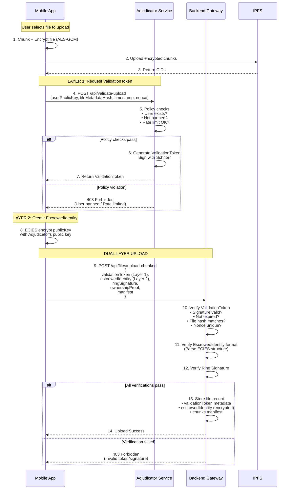

# Investigation Flow - Hybrid Adjudicator Model

**Version:** 1.1
**Date Created:** 2025-10-27
**Status:** ✅ **VALIDATION LAYER LIVE** – Adjudicator service + mobile/backend integration landed; admin dashboard pending
**Priority:** **HIGH** - Complete investigation UX and reporting

---

## 📋 MỤC LỤC

1. [Tổng quan](#1-tổng-quan)
2. [Kiến trúc Hybrid Adjudicator](#2-kiến-trúc-hybrid-adjudicator)
3. [Layer 1: ValidationToken (Real-time)](#3-layer-1-validationtoken-real-time)
4. [Layer 2: EscrowedIdentity (Post-hoc)](#4-layer-2-escrowedidentity-post-hoc)
5. [Upload Flow Enhancement](#5-upload-flow-enhancement)
6. [Investigation Flow](#6-investigation-flow)
7. [Implementation Roadmap](#7-implementation-roadmap)
8. [Security Guarantees](#8-security-guarantees)
9. [Demo Scenarios](#9-demo-scenarios)

---

## 1. TỔNG QUAN

### 1.1. Vấn đề cần giải quyết

**Current State (Phase 1 - COMPLETE):**
- ✅ Anonymous upload với Ring Signature
- ✅ Client-side chunking + encryption
- ✅ Anonymous download với integrity verification
- ✅ Access management (grant/revoke)

**Problem (còn lại):**
- ❌ **Chưa có dashboard điều tra**: cần giao diện và API tổng hợp báo cáo
- ❌ **Workflow pháp lý chưa hoàn thiện**: cần seed key + quy trình phê duyệt admin
- ⚠️ **Testing manual**: chưa có E2E cho ValidationToken/escrow mismatch

### 1.2. Giải pháp: Hybrid Adjudicator Model

**Objective:** Balance giữa **anonymity** và **accountability**

```
┌─────────────────────────────────────────────────────────────┐
│                  HYBRID ADJUDICATOR MODEL                    │
│                                                               │
│   ┌─────────────────┐         ┌──────────────────────┐     │
│   │  Layer 1:       │         │  Layer 2:            │     │
│   │  ValidationToken│         │  EscrowedIdentity    │     │
│   │  (Real-time)    │         │  (Post-hoc)          │     │
│   │                 │         │                      │     │
│   │ • Policy checks │         │ • Encrypted identity │     │
│   │ • Rate limiting │         │ • Investigation only │     │
│   │ • Ban detection │         │ • Cross-reference    │     │
│   │ • Token issuance│         │ • Behavioral analysis│     │
│   └─────────────────┘         └──────────────────────┘     │
│          │                             │                     │
│          ▼                             ▼                     │
│   Schnorr signature            ECIES encryption             │
│   10-minute TTL                Adjudicator-only decrypt     │
└─────────────────────────────────────────────────────────────┘
```

**Key Principles:**
1. **Normal users**: Zero impact, seamless experience (just get token + encrypt identity)
2. **Abuse cases**: Investigation dapat decrypt identity và trace activities
3. **Separation of concerns**: Adjudicator ≠ Backend (policy vs. crypto verification)
4. **Legal compliance**: Investigation requires authorization + audit trail

### 1.3. Implementation Snapshot (2025-10-27)
- ✅ `adjudicator/` microservice (ValidationService + InvestigationService) with Prisma-backed audit trails
- ✅ Mobile upload flow gọi `/api/validate-upload`, tạo `EscrowedIdentity` (XChaCha20-Poly1305) trước khi gửi manifest
- ✅ Backend `/api/files/client-chunked-upload` verify ValidationToken + nonce, lưu relation `ValidationToken`
- ✅ `/api/admin/investigate` bridge + `/api/admin/ban`, `/api/admin/files/:fileId/flag` endpoints with lightweight dashboard (`/admin/index.html`)

---

## 2. KIẾN TRÚC HYBRID ADJUDICATOR

### 2.1. System Components

```
┌────────────────────────────────────────────────────────────┐
│                      SYSTEM ARCHITECTURE                    │
└────────────────────────────────────────────────────────────┘

Mobile App                 Adjudicator Service          Backend Gateway
    │                            │                            │
    │ 1. Request                 │                            │
    │    ValidationToken         │                            │
    ├──────────────────────────►│                            │
    │                            │                            │
    │                       2. Policy Checks                  │
    │                       • User exists?                    │
    │                       • Not banned?                     │
    │                       • Rate limit OK?                  │
    │                            │                            │
    │ 3. ValidationToken         │                            │
    │    + Schnorr signature     │                            │
    │◄──────────────────────────┤                            │
    │                            │                            │
    │ 4. Create EscrowedIdentity │                            │
    │    (ECIES encrypt publicKey)                            │
    │                            │                            │
    │ 5. Upload Request                                       │
    │    • ValidationToken                                    │
    │    • EscrowedIdentity                                   │
    │    • Ring Signature                                     │
    │    • File manifest                                      │
    ├────────────────────────────────────────────────────────►│
    │                            │                       6. Verify
    │                            │                       • ValidationToken signature
    │                            │                       • Token not expired
    │                            │                       • File hash matches
    │                            │                       • Nonce unique
    │                            │                       • EscrowedIdentity format
    │                            │                       • Ring Signature
    │                            │                            │
    │                            │                       7. Store
    │                            │                       • File record
    │                            │                       • ValidationToken metadata
    │                            │                       • EscrowedIdentity (encrypted)
    │                            │                            │
    │ 8. Upload Success          │                            │
    │◄────────────────────────────────────────────────────────┤
    │                            │                            │

─────────────────────────── INVESTIGATION PHASE ───────────────────────────

Admin Dashboard            Adjudicator Service          Backend Gateway
    │                            │                            │
    │ 1. Investigation Request   │                            │
    │    • fileId                │                            │
    │    • reason                │                            │
    │    • legal authorization   │                            │
    ├────────────────────────────────────────────────────────►│
    │                            │                            │
    │                            │                       2. Get file
    │                            │                       • validationToken
    │                            │                       • escrowedIdentity
    │                            │                       • ownershipPublicKey
    │                            │                            │
    │                            │ 3. Decrypt Request         │
    │                            │    • escrowedIdentity      │
    │                            │    • legal auth            │
    │                            │◄───────────────────────────┤
    │                            │                            │
    │                       4. Decrypt ECIES                  │
    │                       realPublicKey = decrypt(escrowedIdentity)
    │                            │                            │
    │                       5. Cross-reference                │
    │                       Layer1Hash == SHA256(realPublicKey)?
    │                            │                            │
    │                       6. Behavioral Analysis            │
    │                       • Query all files from ownershipKey
    │                       • Detect honeypot patterns       │
    │                       • Calculate risk score           │
    │                            │                            │
    │                       7. Generate Report               │
    │                       • Decrypted identity             │
    │                       • Activity summary               │
    │                       • Red flags                      │
    │                       • Recommended actions            │
    │                            │                            │
    │ 8. Investigation Report    │                            │
    │◄──────────────────────────┤                            │
    │                            │                       9. Log Audit
    │                            │                       investigationId, timestamp
    │                            │                            │
```

### 2.2. Separation of Concerns

| Component | Responsibility | What it DOES | What it DOESN'T DO |
|-----------|---------------|--------------|-------------------|
| **Adjudicator** | Policy Enforcement | • Check user exists<br>• Check not banned<br>• Rate limiting<br>• Issue ValidationToken<br>• Decrypt escrowedIdentity | ❌ Verify ring signature<br>❌ Verify file metadata<br>❌ Store file data |
| **Backend** | Crypto Verification | • Verify ValidationToken signature<br>• Verify ring signature<br>• Verify nonce uniqueness<br>• Store file records | ❌ Check user permissions<br>❌ Rate limit enforcement<br>❌ Decrypt escrowedIdentity |
| **Mobile** | Client Logic | • Request ValidationToken<br>• Create EscrowedIdentity<br>• Create ring signature<br>• Upload files | ❌ Policy decisions<br>❌ Investigation |

**Why This Design?**
1. **No redundancy**: Ring signature verified once (at Backend), not twice
2. **Clear boundaries**: Adjudicator = WHO can upload? Backend = IS this upload valid?
3. **Simpler Adjudicator**: No heavy crypto libraries needed
4. **Better performance**: No duplicate 10-20ms crypto operations

---

## 3. LAYER 1: VALIDATIONTOKEN (REAL-TIME)

### 3.1. What is ValidationToken?

**Purpose:** Real-time gate-keeping cho upload requests

**Structure:**
```typescript
interface ValidationToken {
  fileMetadataHash: string;     // SHA256(fileName, size, chunkCount)
  userPublicKeyHash: string;    // SHA256(userPublicKey)
  issuedAt: number;             // Unix timestamp
  expiresAt: number;            // Unix timestamp (issuedAt + 10 minutes)
  signature: string;            // Adjudicator's Schnorr signature
  adjudicatorPublicKey: string; // For verification
}
```

### 3.2. Issuance Flow

**Step 1: Client Request**
```typescript
// Mobile app
const timestamp = Date.now();
const nonce = crypto.randomBytes(32).toString('hex');
const fileMetadataHash = sha256(JSON.stringify({
  fileName: file.name,
  size: file.size,
  chunkCount: chunks.length
}));

const response = await fetch(`${ADJUDICATOR_URL}/api/validate-upload`, {
  method: 'POST',
  body: JSON.stringify({
    userPublicKey: myPublicKey,
    fileMetadataHash,
    timestamp,
    nonce
  })
});

const { validationToken } = await response.json();
```

**Step 2: Adjudicator Policy Checks**
```typescript
// Adjudicator service
async function issueValidationToken(request) {
  // 1. User exists?
  const user = await db.user.findByPublicKey(request.userPublicKey);
  if (!user) throw new Error('User not found');

  // 2. User banned?
  const banned = await db.bannedUser.findByPublicKey(request.userPublicKey);
  if (banned) throw new Error('User is banned');

  // 3. Rate limit OK? (100 tokens per hour)
  const oneHourAgo = Date.now() - 3600000;
  const tokenCount = await db.validationTokenAudit.countWhere({
    userPublicKey: request.userPublicKey,
    issuedAt: { gte: oneHourAgo }
  });
  if (tokenCount >= 100) throw new Error('Rate limit exceeded');

  // 4. Generate token
  const userPublicKeyHash = sha256(request.userPublicKey);
  const issuedAt = Date.now();
  const expiresAt = issuedAt + 600000; // 10 minutes

  // 5. Sign with Schnorr
  const tokenMessage = `${fileMetadataHash}:${userPublicKeyHash}:${issuedAt}:${expiresAt}`;
  const signature = schnorr.sign(
    sha256(tokenMessage),
    adjudicatorPrivateKey
  );

  // 6. Audit log
  await db.validationTokenAudit.create({
    tokenId: uuid(),
    userPublicKey: request.userPublicKey,
    userPublicKeyHash,
    fileMetadataHash,
    issuedAt: new Date(issuedAt),
    expiresAt: new Date(expiresAt),
    signature: signature.toString('hex')
  });

  return {
    fileMetadataHash,
    userPublicKeyHash,
    issuedAt,
    expiresAt,
    signature: signature.toString('hex'),
    adjudicatorPublicKey
  };
}
```

### 3.3. Backend Verification

```typescript
// Backend upload endpoint
async function verifyValidationToken(token, fileMetadata) {
  // 1. Check expiration
  if (Date.now() > token.expiresAt) {
    throw new Error('ValidationToken expired');
  }

  // 2. Verify file hash matches
  const actualFileHash = sha256(JSON.stringify({
    fileName: fileMetadata.fileName,
    size: fileMetadata.size,
    chunkCount: fileMetadata.chunkCount
  }));
  if (actualFileHash !== token.fileMetadataHash) {
    throw new Error('File metadata hash mismatch');
  }

  // 3. Verify Adjudicator's Schnorr signature
  const tokenMessage = `${token.fileMetadataHash}:${token.userPublicKeyHash}:${token.issuedAt}:${token.expiresAt}`;
  const isValid = schnorr.verify(
    Buffer.from(token.signature, 'hex'),
    sha256(tokenMessage),
    Buffer.from(token.adjudicatorPublicKey, 'hex')
  );

  if (!isValid) {
    throw new Error('Invalid ValidationToken signature');
  }

  return true;
}
```

### 3.4. Benefits

✅ **Policy enforcement**: Chỉ authorized users có token
✅ **Rate limiting**: Spam prevention built-in
✅ **Ban compliance**: Banned users rejected immediately
✅ **Audit trail**: Every token issuance logged
✅ **Time-bound**: 10-minute TTL prevents stale tokens

---

## 4. LAYER 2: ESCROWEDIDENTITY (POST-HOC)

### 4.1. What is EscrowedIdentity?

**Purpose:** Encrypted backup của real publicKey cho investigation cases

**Creation:**
```typescript
// Mobile app - ECIES encryption
import * as eccrypto from 'eccrypto';

async function createEscrowedIdentity(
  userPublicKey: string,
  adjudicatorPublicKey: string
): Promise<string> {
  const encrypted = await eccrypto.encrypt(
    Buffer.from(adjudicatorPublicKey, 'hex'),
    Buffer.from(userPublicKey, 'utf8')
  );

  // Serialize ECIES package
  const package = Buffer.concat([
    encrypted.iv,              // 16 bytes
    encrypted.ephemPublicKey,  // 65 bytes
    encrypted.ciphertext,      // variable
    encrypted.mac              // 32 bytes
  ]);

  return package.toString('base64');
}
```

### 4.2. Storage

Backend stores escrowedIdentity **WITHOUT decrypting**:
```javascript
// Backend upload endpoint
await prisma.file.create({
  data: {
    fileName,
    totalSize,
    chunkCount,

    // Layer 1 metadata
    validationToken: {
      create: {
        fileMetadataHash: validationToken.fileMetadataHash,
        userPublicKeyHash: validationToken.userPublicKeyHash,
        issuedAt: new Date(validationToken.issuedAt),
        expiresAt: new Date(validationToken.expiresAt),
        signature: validationToken.signature,
        adjudicatorPublicKey: validationToken.adjudicatorPublicKey
      }
    },

    // Layer 2 backup (ENCRYPTED - backend cannot read)
    escrowedIdentity,

    // Existing fields
    ringSignature,
    ownershipPublicKey
  }
});
```

### 4.3. Decryption (Investigation Only)

**Strict Requirements:**
1. ✅ Admin approval (signature)
2. ✅ Legal authorization (court order, warrant)
3. ✅ Audit trail (investigation logged)
4. ✅ Adjudicator-only (private key never shared)

```typescript
// Adjudicator InvestigationService
async function decryptEscrowedIdentity(
  encryptedIdentity: string,
  legalAuthorization: string
): Promise<string> {
  // 1. Verify legal authorization exists
  if (!legalAuthorization) {
    throw new Error('Legal authorization required');
  }

  // 2. Decrypt with Adjudicator's ECIES private key
  const encryptedBuffer = Buffer.from(encryptedIdentity, 'base64');
  const decrypted = await eccrypto.decrypt(
    adjudicatorECIESPrivateKey,
    {
      iv: encryptedBuffer.slice(0, 16),
      ephemPublicKey: encryptedBuffer.slice(16, 81),
      ciphertext: encryptedBuffer.slice(81, -32),
      mac: encryptedBuffer.slice(-32)
    }
  );

  // 3. Log investigation
  await db.investigationAudit.create({
    investigationId: uuid(),
    timestamp: new Date(),
    legalAuthorization,
    decryptedPublicKey: decrypted.toString('utf8')
  });

  return decrypted.toString('utf8');
}
```

### 4.4. Cross-Reference (Layer 1 ↔ Layer 2)

**Integrity Check:**
```typescript
async function verifyIdentityConsistency(
  realPublicKey: string,  // From Layer 2 (decrypted)
  fileId: string
): Promise<boolean> {
  // 1. Get file with validationToken
  const file = await prisma.file.findUnique({
    where: { id: fileId },
    include: { validationToken: true }
  });

  // 2. Calculate hash from decrypted publicKey
  const publicKeyHash = sha256(realPublicKey);

  // 3. Compare với Layer 1 hash
  return file.validationToken.userPublicKeyHash === publicKeyHash;
}
```

**If mismatch detected:**
- 🚨 **CRITICAL ALERT**: Identity tampering detected!
- User may have forged ValidationToken
- Immediate ban + forensic investigation

---

## 5. UPLOAD FLOW ENHANCEMENT

### 5.1. New Upload Flow Diagram



### 5.2. Code Changes Required

**Mobile: Request ValidationToken**
```typescript
// mobile/src/services/AdjudicatorService.ts
async function requestValidationToken(params: {
  fileMetadata: { fileName: string; size: number; chunkCount: number };
}): Promise<ValidationToken> {
  const publicKey = await getPublicKey();
  const timestamp = Date.now();
  const nonce = generateNonce();

  const fileMetadataHash = sha256Hex(
    JSON.stringify({
      fileName: params.fileMetadata.fileName,
      size: params.fileMetadata.size,
      chunkCount: params.fileMetadata.chunkCount
    })
  );

  const response = await fetch(`${ADJUDICATOR_URL}/api/validate-upload`, {
    method: 'POST',
    headers: { 'Content-Type': 'application/json' },
    body: JSON.stringify({
      userPublicKey: publicKey,
      fileMetadataHash,
      timestamp,
      nonce
    })
  });

  if (!response.ok) {
    const error = await response.json();
    throw new Error(error.error || 'Failed to get ValidationToken');
  }

  const data = await response.json();
  return data.validationToken;
}
```

**Mobile: Create EscrowedIdentity**
```typescript
// mobile/src/services/EscrowService.ts
import * as eccrypto from 'eccrypto';

async function createEscrowedIdentity(
  userPublicKey: string,
  adjudicatorPublicKey: string
): Promise<string> {
  const encrypted = await eccrypto.encrypt(
    Buffer.from(adjudicatorPublicKey, 'hex'),
    Buffer.from(userPublicKey, 'utf8')
  );

  const package = Buffer.concat([
    encrypted.iv,
    encrypted.ephemPublicKey,
    encrypted.ciphertext,
    encrypted.mac
  ]);

  return package.toString('base64');
}
```

**Backend: Verify Dual Layers**
```javascript
// backend/src/routes/files.js
router.post('/upload-chunked', async (req, res) => {
  const {
    fileName, totalSize, chunkCount, chunks,
    validationToken,
    escrowedIdentity,
    ringSignature,
    ownershipProof,
    timestamp, nonce
  } = req.body;

  try {
    // ============ LAYER 1: ValidationToken ============
    // 1. Check expiration
    if (Date.now() > validationToken.expiresAt) {
      return res.status(403).json({ error: 'ValidationToken expired' });
    }

    // 2. Verify file hash
    const actualFileHash = sha256(JSON.stringify({ fileName, size: totalSize, chunkCount }));
    if (actualFileHash !== validationToken.fileMetadataHash) {
      return res.status(403).json({ error: 'File metadata hash mismatch' });
    }

    // 3. Verify Schnorr signature
    const tokenMessage = `${validationToken.fileMetadataHash}:${validationToken.userPublicKeyHash}:${validationToken.issuedAt}:${validationToken.expiresAt}`;
    const isTokenValid = await verifySchnorrSignature(
      validationToken.signature,
      tokenMessage,
      validationToken.adjudicatorPublicKey
    );
    if (!isTokenValid) {
      return res.status(403).json({ error: 'Invalid ValidationToken signature' });
    }

    // 4. Verify nonce uniqueness
    const nonceUsed = await redis.exists(`nonce_${nonce}`);
    if (nonceUsed) {
      return res.status(403).json({ error: 'Nonce already used' });
    }
    await redis.set(`nonce_${nonce}`, 'used', 'EX', 600);

    // ============ LAYER 2: EscrowedIdentity ============
    // Verify ECIES format (không decrypt)
    const escrowBuffer = Buffer.from(escrowedIdentity, 'base64');
    if (escrowBuffer.length < 113) {
      return res.status(400).json({ error: 'Invalid EscrowedIdentity format' });
    }

    // ============ Existing verifications ============
    // Ring signature, ownership proof...

    // ============ Store with both layers ============
    const file = await prisma.file.create({
      data: {
        fileName, totalSize, chunkCount,
        chunks: { create: chunks },

        // Layer 1
        validationToken: {
          create: {
            fileMetadataHash: validationToken.fileMetadataHash,
            userPublicKeyHash: validationToken.userPublicKeyHash,
            issuedAt: new Date(validationToken.issuedAt),
            expiresAt: new Date(validationToken.expiresAt),
            signature: validationToken.signature,
            adjudicatorPublicKey: validationToken.adjudicatorPublicKey
          }
        },

        // Layer 2
        escrowedIdentity,

        // Existing
        ringSignature,
        ownershipPublicKey: ownershipProof.publicKey
      }
    });

    res.json({ success: true, fileId: file.id });
  } catch (error) {
    console.error('[Upload] Error:', error);
    res.status(500).json({ error: error.message });
  }
});
```

---

## 6. INVESTIGATION FLOW

### 6.1. Trigger Conditions

Investigation chỉ được trigger khi:
1. ✅ User report (abuse, malware, honeypot)
2. ✅ Automated detection (revocation patterns, high-risk behavior)
3. ✅ Legal request (court order, law enforcement)
4. ✅ Admin review (flagged content)

**Never for:**
- ❌ Routine monitoring
- ❌ Data mining
- ❌ User profiling
- ❌ Marketing purposes

### 6.2. Investigation Request Flow

```typescript
// Admin Dashboard → Backend → Adjudicator
async function investigateFile(params: {
  fileId: string;
  reason: string;
  legalAuthorization: string;
  adminSignature: string;
}): Promise<InvestigationReport> {
  // 1. Get file with escrowedIdentity
  const file = await prisma.file.findUnique({
    where: { id: params.fileId },
    include: {
      validationToken: true,
      chunks: true,
      revocations: true
    }
  });

  if (!file) {
    throw new Error('File not found');
  }

  // 2. Send to Adjudicator for decryption
  const adjudicatorResponse = await fetch(`${ADJUDICATOR_URL}/api/decrypt-escrow`, {
    method: 'POST',
    headers: {
      'Content-Type': 'application/json',
      'X-Admin-Authorization': params.adminSignature
    },
    body: JSON.stringify({
      fileId: params.fileId,
      escrowedIdentity: file.escrowedIdentity,
      investigationReason: params.reason,
      legalAuthorization: params.legalAuthorization
    })
  });

  if (!adjudicatorResponse.ok) {
    throw new Error('Adjudicator rejected investigation request');
  }

  const report = await adjudicatorResponse.json();

  // 3. Log investigation
  await prisma.investigationAudit.create({
    data: {
      investigationId: report.legalCompliance.investigationId,
      fileId: params.fileId,
      reason: params.reason,
      legalAuthorization: params.legalAuthorization,
      adminSignature: params.adminSignature,
      decryptedPublicKey: report.decryptedIdentity.realPublicKey,
      timestamp: new Date()
    }
  });

  return report;
}
```

### 6.3. Investigation Report Structure

```typescript
interface InvestigationReport {
  // PHASE 1: Identity Resolution
  decryptedIdentity: {
    realPublicKey: string;           // Decrypted từ escrowedIdentity
    publicKeyHash: string;            // SHA256(realPublicKey)
    ownershipPublicKey: string;       // From file record
    consistencyCheck: boolean;        // Layer1 hash == Layer2 hash?
  };

  // PHASE 2: Activity Analysis
  activitySummary: {
    filesWithSameOwnershipKey: number;  // Linkable files
    totalRevocations: number;            // Revocation count
    avgTimeBeforeRevoke: number;         // Hours (honeypot detection)
    firstUploadTimestamp: Date;
    lastActivityTimestamp: Date;
  };

  // PHASE 3: Red Flags Detection
  redFlags: string[];  // e.g., ["Grants access then revokes quickly (honeypot pattern)"]

  // PHASE 4: Risk Assessment
  riskAssessment: {
    overallRisk: 'HIGH' | 'MEDIUM' | 'LOW';
    threatType: string;  // "Honeypot attack", "Spam", "Malware distribution"
    confidence: number;  // 0-1 scale
    reasoning: string;   // Explanation
  };

  // PHASE 5: Recommendations
  recommendedActions: string[];  // e.g., ["Blacklist publicKey", "Flag all files"]

  // PHASE 6: Legal Compliance
  legalCompliance: {
    investigationId: string;
    requestedBy: string;
    legalAuthorization: string;
    decryptionTimestamp: Date;
    auditLogId: string;
  };
}
```

### 6.4. Behavioral Analysis Algorithm

**Honeypot Detection:**
```typescript
function analyzeRevocationPattern(files: File[]): string[] {
  const redFlags: string[] = [];

  // 1. Quick revocation pattern
  const revocationTimes = files.flatMap(f =>
    f.revocations.map(r => r.createdAt.getTime() - f.createdAt.getTime())
  );
  const avgTimeBeforeRevoke = revocationTimes.reduce((sum, t) => sum + t, 0) / revocationTimes.length;
  const avgHours = avgTimeBeforeRevoke / (1000 * 60 * 60);

  if (avgHours < 48) {
    redFlags.push(`Grants access then revokes quickly (avg ${avgHours.toFixed(1)}h - honeypot pattern)`);
  }

  // 2. High revocation ratio
  const totalRevocations = files.reduce((sum, f) => sum + f.revocations.length, 0);
  const revocationRatio = totalRevocations / files.length;

  if (revocationRatio > 0.4) {
    redFlags.push(`High revocation-to-upload ratio (${Math.round(revocationRatio * 100)}%)`);
  }

  // 3. Ownership key reuse
  if (files.length > 30) {
    redFlags.push(`Uses same ownershipPublicKey repeatedly (${files.length} files linkable)`);
  }

  // 4. Rapid uploads
  const uploadTimes = files.map(f => f.createdAt.getTime()).sort();
  const uploadGaps = [];
  for (let i = 1; i < uploadTimes.length; i++) {
    uploadGaps.push(uploadTimes[i] - uploadTimes[i-1]);
  }
  const avgGap = uploadGaps.reduce((sum, g) => sum + g, 0) / uploadGaps.length;
  const avgGapMinutes = avgGap / (1000 * 60);

  if (avgGapMinutes < 5) {
    redFlags.push(`Rapid uploads (avg ${avgGapMinutes.toFixed(1)} min between uploads - spam pattern)`);
  }

  return redFlags;
}
```

**Risk Scoring:**
```typescript
function calculateRiskScore(redFlags: string[]): {
  overallRisk: 'HIGH' | 'MEDIUM' | 'LOW';
  confidence: number;
} {
  const flagCount = redFlags.length;

  if (flagCount >= 3) {
    return {
      overallRisk: 'HIGH',
      confidence: Math.min(flagCount / 5, 1.0)  // Max 1.0
    };
  } else if (flagCount >= 1) {
    return {
      overallRisk: 'MEDIUM',
      confidence: flagCount / 5
    };
  } else {
    return {
      overallRisk: 'LOW',
      confidence: 0
    };
  }
}
```

---

## 7. IMPLEMENTATION ROADMAP

### Phase 1: Upload Flow Enhancement (Week 1 - 5 days)

#### Bước 1.1: Tạo Adjudicator Service (2 days)
**Files:**
- `adjudicator/src/services/ValidationService.ts`
- `adjudicator/src/services/InvestigationService.ts`
- `adjudicator/src/routes/validate.ts`
- `adjudicator/src/routes/investigate.ts`

**Tasks:**
- [ ] Setup project structure (Express + TypeScript)
- [ ] Implement ValidationService (policy checks + token issuance)
- [ ] Implement InvestigationService (ECIES decryption + analysis)
- [ ] Generate Adjudicator keypairs (Schnorr + ECIES)
- [ ] Add database models (Prisma)
- [ ] Deploy service (port 4000)

#### Bước 1.2: Update Mobile Upload Flow (1.5 days)
**Files:**
- `mobile/src/services/AdjudicatorService.ts`
- `mobile/src/services/EscrowService.ts`
- `mobile/src/components/ipfs/AOTUploadModal.tsx`

**Tasks:**
- [ ] Add `requestValidationToken()` function
- [ ] Add `createEscrowedIdentity()` function
- [ ] Update upload flow with dual-layer
- [ ] Handle ValidationToken errors (rate limit, banned)
- [ ] Add loading states in UI

#### Bước 1.3: Update Backend Verification (1 day)
**Files:**
- `backend/src/routes/files.js`
- `backend/src/utils/schnorr.js`

**Tasks:**
- [ ] Add ValidationToken verification logic
- [ ] Add EscrowedIdentity format validation
- [ ] Add nonce tracking (Redis)
- [ ] Update file creation with both layers
- [ ] Test with Postman

#### Bước 1.4: Database Schema (0.5 day)
**Files:**
- `backend/prisma/schema.prisma`
- `adjudicator/prisma/schema.prisma`

**Tasks:**
- [ ] Add `ValidationToken` model
- [ ] Add `InvestigationAudit` model
- [ ] Add `ValidationTokenAudit` model (Adjudicator DB)
- [ ] Add `BannedUser` model (Adjudicator DB)
- [ ] Run migrations

### Phase 2: Investigation Flow (Week 2 - 4 days)

#### Bước 2.1: Admin Investigation API (1 day)
**Files:**
- `backend/src/routes/admin.js`
- `backend/src/middleware/adminAuth.js`

**Tasks:**
- [ ] Create admin routes
- [ ] Add admin authentication middleware
- [ ] Implement investigation endpoint
- [ ] Test with test admin credentials

#### Bước 2.2: Admin Dashboard UI (1.5 days)
**Files:**
- `admin-dashboard/src/pages/InvestigationPage.tsx`
- `admin-dashboard/src/components/InvestigationReport.tsx`

**Tasks:**
- [ ] Create admin dashboard project (React/Next.js)
- [ ] Implement InvestigationPage UI
- [ ] Display comprehensive report
- [ ] Add action buttons (ban user, flag files)

#### Bước 2.3: E2E Testing (1 day)
**Files:**
- `backend/src/__tests__/investigation.e2e.test.js`
- `mobile/__tests__/e2e/upload-with-adjudicator.test.ts`

**Tasks:**
- [ ] Write E2E test: normal upload flow
- [ ] Write E2E test: banned user rejection
- [ ] Write E2E test: rate limit
- [ ] Write E2E test: investigation flow
- [ ] Performance benchmarks

#### Bước 2.4: Demo Preparation (0.5 day)
**Files:**
- `DEMO_INVESTIGATION.md`

**Tasks:**
- [ ] Write demo script
- [ ] Prepare test data (normal + abuse cases)
- [ ] Record demo video
- [ ] Presentation slides

**Total Effort:** 9 days (2 weeks)

---

## 8. SECURITY GUARANTEES

### 8.1. Anonymity Preservation

✅ **Normal users maintain full anonymity:**
- ValidationToken chỉ có hash, không có real publicKey
- Backend KHÔNG bao giờ thấy real publicKey
- EscrowedIdentity encrypted, không thể đọc
- Ring signature vẫn ẩn danh

### 8.2. Investigation Safeguards

✅ **Strict investigation protocol:**
- Requires legal authorization
- Requires admin signature
- Full audit trail
- Adjudicator-only decryption
- Cannot be done in secret

### 8.3. Abuse Prevention

✅ **Multiple layers of protection:**
- Rate limiting (100 tokens/hour)
- Ban enforcement
- Nonce tracking (replay prevention)
- ValidationToken TTL (10 minutes)
- Cross-reference validation (Layer 1 ↔ Layer 2)

### 8.4. Threat Model Coverage

| Threat | Mitigation |
|--------|-----------|
| **Honeypot Attack** | Investigation detects quick revocation patterns |
| **Spam Uploads** | Rate limiting + behavioral analysis |
| **Token Forgery** | Schnorr signature verification |
| **Replay Attack** | Nonce tracking (Redis) |
| **Banned User** | Adjudicator rejects token issuance |
| **Identity Tampering** | Cross-reference Layer 1 & Layer 2 |
| **Malicious Admin** | Investigation audit trail + legal authorization required |

---

## 9. DEMO SCENARIOS

### Scenario 1: Normal User Upload (Happy Path)

```
1. Alice opens app
2. Selects PDF file (2MB)
3. App requests ValidationToken from Adjudicator
   → Policy checks pass
   → Token issued (10-min TTL)
4. App creates EscrowedIdentity (ECIES encrypt Alice's publicKey)
5. App uploads với ValidationToken + EscrowedIdentity
6. Backend verifies:
   ✓ Token signature valid
   ✓ Token not expired
   ✓ File hash matches
   ✓ Nonce unique
   ✓ EscrowedIdentity format OK
   ✓ Ring signature valid
7. Upload success!
8. Alice's identity remains anonymous

**Demo Point:** Seamless experience, zero friction
```

### Scenario 2: Banned User Rejected

```
1. Bob (banned user) opens app
2. Selects file to upload
3. App requests ValidationToken
4. Adjudicator checks:
   → User exists? ✓
   → Not banned? ✗ BANNED
5. Adjudicator rejects: 403 Forbidden
6. Bob sees: "Your account has been suspended"

**Demo Point:** Real-time ban enforcement
```

### Scenario 3: Rate Limit Exceeded

```
1. Charlie uploads 100 files in 1 hour
2. Tries to upload 101st file
3. Adjudicator checks:
   → User exists? ✓
   → Not banned? ✓
   → Rate limit? ✗ 100/100 used
4. Adjudicator rejects: 429 Too Many Requests
5. Charlie sees: "Please wait before uploading more files"

**Demo Point:** Spam prevention
```

### Scenario 4: Honeypot Investigation

```
1. Dave uploads 50 files
2. Grants access to multiple users
3. Revokes ALL access after 24 hours (honeypot pattern)
4. User reports suspicious behavior
5. Admin triggers investigation:
   → fileId: <Dave's file>
   → reason: "Suspected honeypot attack"
   → legal authorization: "Report #12345"
6. Adjudicator decrypts escrowedIdentity → Dave's real publicKey
7. Behavioral analysis:
   → 50 files with same ownershipPublicKey
   → 120 total revocations
   → Avg 18 hours before revoke
   → RED FLAGS:
     * "Grants access then revokes quickly (honeypot pattern)"
     * "High revocation-to-upload ratio (240%)"
     * "Uses same ownershipPublicKey repeatedly (50 files linkable)"
8. Risk Assessment:
   → Overall Risk: HIGH
   → Threat Type: Honeypot attack
   → Confidence: 60%
9. Recommended Actions:
   → Blacklist Dave's publicKey
   → Flag all 50 files
   → Notify affected accessors
10. Admin bans Dave
11. Future uploads from Dave rejected at ValidationToken stage

**Demo Point:** Post-hoc investigation with behavioral analysis
```

### Scenario 5: Cross-Reference Validation

```
1. Eve tries to forge ValidationToken:
   → Creates fake token with Charlie's publicKeyHash
   → But EscrowedIdentity contains Eve's real publicKey
2. Eve uploads file
3. Backend accepts (token looks valid)
4. Later, suspicious activity triggers investigation
5. Adjudicator decrypts EscrowedIdentity → Eve's publicKey
6. Cross-reference:
   → Layer 1 hash: SHA256(Charlie's publicKey)
   → Layer 2 hash: SHA256(Eve's publicKey)
   → MISMATCH! 🚨
7. CRITICAL ALERT: Identity tampering detected
8. Eve immediately banned
9. Forensic investigation triggered

**Demo Point:** Cross-layer consistency check catches forgery
```

---

## 10. COMPARISON TABLE

| Feature | Phase 1 (Current) | Phase 2 (With Investigation) |
|---------|------------------|------------------------------|
| **Anonymity** | ✅ Full (Ring Signature) | ✅ Full (for normal users) |
| **Policy Enforcement** | ❌ None | ✅ Real-time (ValidationToken) |
| **Rate Limiting** | ❌ None | ✅ 100 tokens/hour |
| **Ban Enforcement** | ❌ None | ✅ Rejected at token stage |
| **Investigation** | ❌ Impossible | ✅ Legal + authorized only |
| **Abuse Detection** | ❌ None | ✅ Behavioral analysis |
| **Honeypot Defense** | ❌ No detection | ✅ Pattern detection |
| **Accountability** | ❌ Zero accountability | ✅ Escrowed accountability |
| **User Experience** | ✅ Simple | ✅ Same (1 extra API call) |
| **Performance** | ✅ Fast | ✅ +200ms (token request) |

---

## 11. NEXT STEPS

### Immediate (This Week)
1. ✅ Review implementation plan với team
2. ⬜ Setup Adjudicator service project
3. ⬜ Generate Adjudicator keypairs
4. ⬜ Implement ValidationService
5. ⬜ Test token issuance

### Week 2
1. Update upload flow (mobile + backend)
2. Implement InvestigationService
3. Build admin dashboard
4. E2E testing
5. Demo preparation

---

**Document Version:** 1.0
**Last Updated:** 2025-10-27
**Status:** Design Complete - Ready for Implementation
**Next Review:** After Phase 1 completion
