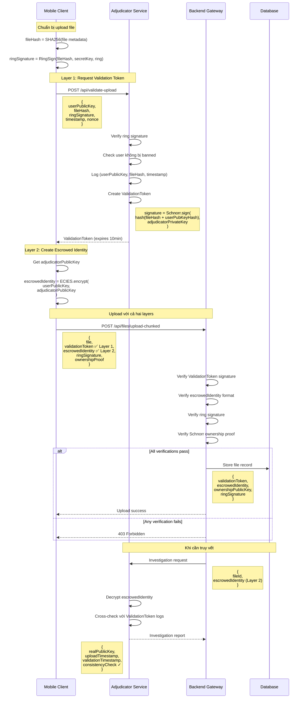
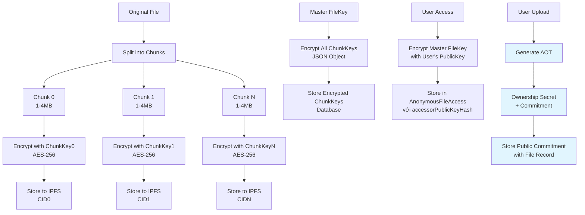
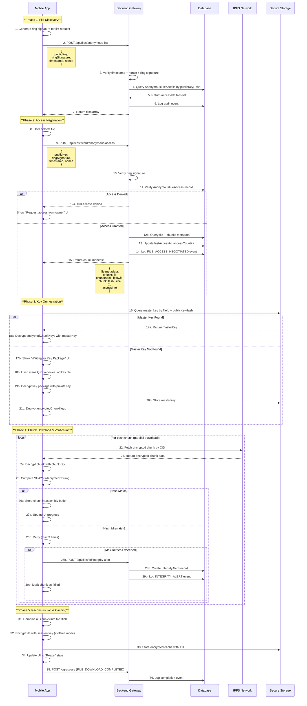
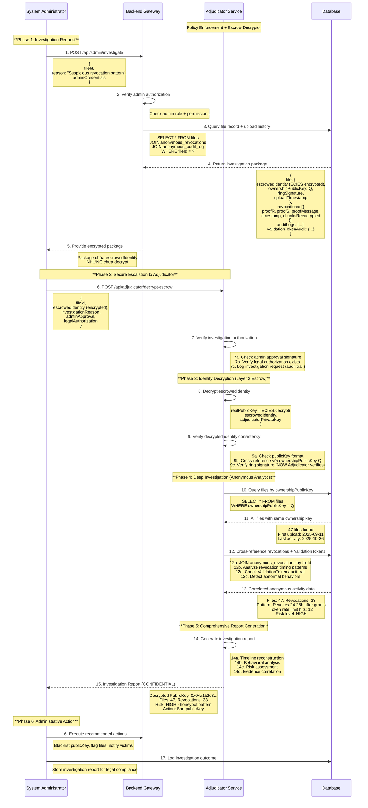

# **Kiến trúc Hệ thống Toàn diện: Giải pháp Lưu trữ Phi tập trung với AOT và Chunk-based Optimization**

## **Tổng quan**

Bài viết này trình bày kiến trúc hệ thống cuối cùng cho đề tài **"Giải pháp lưu trữ và chia sẻ dữ liệu phi tập trung đảm bảo tính riêng tư"**. Kiến trúc này tích hợp các cơ chế mật mã nâng cao với **Anonymous Ownership Tokens (AOT)** và kỹ thuật chunk-based storage để đạt được sự cân bằng tối ưu giữa ẩn danh, bảo mật, quyền sở hữu ẩn danh, hiệu suất và khả năng truy vết có giám sát.

---

### **Mô hình danh tính ẩn danh phía người dùng**

- **Thông tin lưu trên backend được rút gọn tối đa**: mỗi bản ghi user chỉ còn `displayLabel` (bí danh dễ nhận biết trong UI) và `publicKey`. Không có email, mật khẩu hay secret key lưu trên máy chủ.
- **HOÀN TOÀN ẨN DANH - KHÔNG có `userId` trong anonymous flow**: Hệ thống sử dụng `publicKeyHash = SHA256(publicKey)` để track anonymous users thay vì userId. Tất cả anonymous endpoints (anonymous-list, anonymous-access, anonymous-audit-log) KHÔNG yêu cầu userId, chỉ dùng publicKey + ringSignature để authenticate.
- **Chia sẻ khóa ngoại tuyến**: khi chủ sở hữu gửi secure key package, họ sử dụng public key của người nhận để mã hóa master key. App của người nhận tự decrypt và lưu vào SecureStorage. Backend KHÔNG lưu trữ master key.
- **Escrowed identity** tiếp tục phục vụ cơ chế giám sát đặc biệt; chỉ Adjudicator mới có thể giải mã nếu cần quy trách nhiệm.

## **1. Các Khái niệm Mật mã Nền tảng**

### **A. Chữ ký Vòng (Ring Signature)**

Chữ ký vòng là một loại chữ ký điện tử cho phép một thành viên trong một nhóm người ký một thông điệp thay mặt cho cả nhóm, nhưng không ai có thể biết chính xác thành viên nào đã thực hiện việc ký đó.

#### **Tạo Chữ ký Vòng:**
- **Đầu vào:**
    1. **Thông điệp cần ký:** Hash của file metadata (`h(M)`)
    2. **Khóa bí mật của người ký (`SecretKey_User`):** Khóa bí mật được tự tạo và lưu trên thiết bị
    3. **Tập hợp khóa công khai của nhóm (`Ring`):** Danh sách `PublicKey` của tất cả thành viên trong nhóm ký
- **Quá trình:** Sử dụng thuật toán mật mã kết hợp `SecretKey` với danh sách `PublicKey` để tạo ra Chữ ký Vòng (`σ`)

#### **Xác thực Chữ ký Vòng:**
- **Đầu vào:** Thông điệp gốc, Chữ ký Vòng (`σ`), và danh sách `PublicKey` của nhóm
- **Quá trình:** Backend Gateway chạy thuật toán kiểm tra trả về `True` nếu hợp lệ

### **B. Phong bì Ký gửi (Escrowed Identity)**

Để đạt được **"ẩn danh có giám sát"**, hệ thống sử dụng cơ chế phong bì ký gửi:

- **`escrowedIdentity`**: "Phong bì niêm phong kỹ thuật số" chứa danh tính thật của người ký
- **Niêm phong**: Được mã hóa bằng `PublicKey_Adjudicator` - chỉ Bên Giám sát mới có thể mở
- **Bên Giám sát (Adjudicator)**: Thực thể tin cậy có cặp khóa riêng, `PublicKey` được công bố công khai

#### **Kiến trúc Dual-Layer Accountability: Hybrid Adjudicator Model**

Hệ thống triển khai **hai lớp kiểm soát trách nhiệm (accountability)** để đạt được sự cân bằng tối ưu giữa bảo mật, ẩn danh và khả năng truy vết:

**Layer 1: Real-time Upload Validation (Adjudicator-as-Validator)**
- Client yêu cầu **ValidationToken** từ Adjudicator trước khi upload
- Adjudicator xác thực danh tính và cấp token có chữ ký số
- Backend verify token cryptographically → không thể forge

**Layer 2: Post-hoc Investigation (Adjudicator-as-Escrow-Decryptor)**
- Client tạo `escrowedIdentity` mã hóa bằng Adjudicator's public key
- Backend lưu trữ escrowedIdentity (backup accountability)
- Chỉ Adjudicator mới decrypt khi cần điều tra

##### **So sánh hai lớp:**

| Tính năng | Layer 1: Validation | Layer 2: Escrow |
|-----------|-------------------|-----------------|
| **Timing** | Real-time (trước upload) | Post-hoc (sau khi upload) |
| **Security Guarantee** | Cryptographic signature | Encrypted backup |
| **Privacy Impact** | Adjudicator biết mọi upload | Adjudicator chỉ biết khi investigate |
| **Forgery Prevention** | ✅ Strong (signature-based) | ⚠️ Weak (client tự encrypt) |
| **Scalability** | ⚠️ Adjudicator bottleneck | ✅ Passive (không tác động performance) |
| **Tradeoff** | Less privacy, more control | More privacy, less control |

##### **Validation Token Protocol:**

```typescript
// Phase 1: Client request validation từ Adjudicator
interface ValidationRequest {
    userPublicKey: string;           // Real identity của uploader
    fileMetadataHash: string;        // SHA256(file metadata)
    ringSignature: string;           // Proof of group membership
    timestamp: number;
    nonce: string;
}

// Phase 2: Adjudicator cấp ValidationToken
interface ValidationToken {
    fileMetadataHash: string;        // File được authorize
    userPublicKeyHash: string;       // SHA256(userPublicKey) - không lộ raw key
    issuedAt: number;
    expiresAt: number;               // Token TTL: 10 minutes

    // Adjudicator's Schnorr signature
    signature: string;               // Sign(hash(above), AdjudicatorPrivateKey)
    adjudicatorPublicKey: string;    // Key để verify signature
}

// Phase 3: Backend verification
function verifyValidationToken(token: ValidationToken): boolean {
    // 1. Verify Adjudicator's signature
    const message = hash(
        token.fileMetadataHash +
        token.userPublicKeyHash +
        token.issuedAt +
        token.expiresAt
    );

    const signatureValid = schnorrVerify(
        token.signature,
        message,
        token.adjudicatorPublicKey
    );

    if (!signatureValid) return false;

    // 2. Check expiration
    if (Date.now() > token.expiresAt) return false;

    // 3. Verify file hash matches
    const actualFileHash = hash(uploadedFile.metadata);
    if (actualFileHash !== token.fileMetadataHash) return false;

    return true;
}
```

##### **Luồng Upload với Hybrid Model:**



##### **Security Properties của Hybrid Model:**

**1. Defense-in-Depth:**
```
✅ Layer 1 prevents fake uploads (signature verification)
✅ Layer 2 provides backup investigation (encrypted identity)
✅ Nếu client forge escrowedIdentity → vẫn caught bởi ValidationToken
✅ Nếu ValidationToken bị stolen → escrowedIdentity provides forensics
```

**2. Non-repudiation:**
```
✅ ValidationToken có Adjudicator's signature → không thể deny
✅ EscrowedIdentity có encrypted real identity → không thể deny
✅ Cross-validation giữa 2 layers tăng độ tin cậy
```

**3. Threat Mitigation:**

| Threat | Layer 1 Protection | Layer 2 Protection | Combined |
|--------|-------------------|-------------------|----------|
| **Client forge escrowedIdentity** | ✅ Caught by ValidationToken | ❌ Không phát hiện | ✅ **Strong** |
| **Replay attack** | ✅ Token expiration + nonce | ✅ Timestamp freshness | ✅ **Strong** |
| **Token theft** | ⚠️ Short TTL (10min) | ✅ Ownership proof binding | ✅ **Strong** |
| **Adjudicator compromise** | ❌ Critical failure | ❌ Critical failure | ❌ **Weak** |
| **Backend collusion** | ✅ Cannot forge token | ✅ Cannot decrypt escrow | ✅ **Strong** |

**4. Performance & Scalability:**

```typescript
interface PerformanceMetrics {
    // Layer 1: Validation Token Request
    validationLatency: "~50-100ms";      // Adjudicator signature
    validationBottleneck: "Moderate";    // Scalable với caching

    // Layer 2: Escrow Creation
    escrowCreationLatency: "~20-30ms";   // Client-side ECIES encryption
    escrowBottleneck: "None";            // Client-side only

    // Combined Overhead
    totalUploadOverhead: "~70-130ms";    // Acceptable cho user experience
    scalabilityLimit: "Adjudicator throughput";  // Có thể scale horizontal
}
```

**Scalability Solutions:**
1. **Token Caching:** ValidationToken với TTL dài (1 hour) cho multiple uploads
2. **Batch Validation:** Client request validation cho nhiều files cùng lúc
3. **Adjudicator Clustering:** Horizontal scaling với load balancer
4. **Async Validation:** Background validation không block upload (với review period)

##### **Implementation Trade-offs:**

**Option 1: Validation-Primary (Recommended for Demo)**
```typescript
// Ưu tiên ValidationToken, escrowedIdentity là optional
const uploadConfig = {
    requireValidationToken: true,      // ✅ Mandatory
    requireEscrowedIdentity: false,    // ⚠️ Optional (fallback)

    rationale: "Strong immediate verification, escrow as backup"
};
```

**Option 2: Escrow-Primary (Thesis Original)**
```typescript
// Ưu tiên escrowedIdentity, ValidationToken là enhancement
const uploadConfig = {
    requireValidationToken: false,     // ⚠️ Optional (enhancement)
    requireEscrowedIdentity: true,     // ✅ Mandatory

    rationale: "Maximum privacy, post-hoc investigation"
};
```

**Option 3: Dual-Mandatory (Maximum Security)**
```typescript
// Yêu cầu cả hai layers
const uploadConfig = {
    requireValidationToken: true,      // ✅ Mandatory
    requireEscrowedIdentity: true,     // ✅ Mandatory

    rationale: "Defense-in-depth, redundant accountability"
};
```

**Khuyến nghị cho thesis:** **Option 3 (Dual-Mandatory)** để demonstrate comprehensive security architecture.

---

### **C. Anonymous Ownership Tokens (AOT) - Schnorr Ownership Proof**

**AOT** là cơ chế mật mã cho phép chứng minh quyền sở hữu file một cách ẩn danh, giải quyết vấn đề **"Paradox của Anonymous Ownership"**. Hệ thống sử dụng **Schnorr Signature** dựa trên bài toán logarit rời rạc (Discrete Logarithm Problem) để đảm bảo bảo mật mà không tiết lộ private key.

#### **Tại sao chọn Schnorr thay vì ECDSA?**

1. **Design Purpose**: Schnorr được thiết kế cho identification schemes, phù hợp cho ownership verification
2. **Performance**: ~50% nhanh hơn ECDSA trong verification (critical cho mobile app)
3. **Mathematical Elegance**: Proof of correctness đơn giản và elegant hơn
4. **Non-malleability**: Không có signature malleability như ECDSA
5. **Modern Adoption**: Bitcoin Taproot (2021) đã chuyển sang Schnorr

#### **Nguyên lý Hoạt động:**

**Schnorr Ownership Proof** sử dụng elliptic curve secp256k1 và challenge-response protocol:

```typescript
interface SchnorrOwnershipToken {
    // Public component (stored in database)
    ownershipPublicKey: string;      // Q = k·G (elliptic curve public key)

    // Private component (ONLY owner keeps)
    ownershipPrivateKey: string;     // k (scalar private key)
}

interface SchnorrOwnershipProof {
    R: string;          // R = r·G (commitment, fresh mỗi proof)
    s: string;          // s = r + e·k (response)
    message: string;    // Message được sign (fileId + timestamp)
}

// Khi upload file - Generate ownership keypair
function generateSchnorrOwnershipToken(): SchnorrOwnershipToken {
    const curve = elliptic.ec('secp256k1');

    // 1. Generate random private key k
    const ownershipKeyPair = curve.genKeyPair();
    const k = ownershipKeyPair.getPrivate('hex');

    // 2. Compute public key Q = k·G
    const Q = ownershipKeyPair.getPublic();
    const ownershipPublicKey = Q.encode('hex', false); // Uncompressed

    return {
        ownershipPublicKey,       // Store in database
        ownershipPrivateKey: k    // Keep on device (NEVER send to server)
    };
}

// Khi cần prove ownership - Schnorr Signature
function createSchnorrOwnershipProof(
    message: string,                // fileId + ":" + timestamp
    ownershipPrivateKey: string     // k (private key)
): SchnorrOwnershipProof {
    const curve = elliptic.ec('secp256k1');

    // CRITICAL: Generate FRESH random nonce mỗi proof
    const r = curve.genKeyPair().getPrivate(); // Fresh r
    const R = curve.g.mul(r); // R = r·G

    // 1. Compute challenge: e = Hash(R || Q || message)
    const Q = curve.g.mul(ownershipPrivateKey);
    const e = BigInt('0x' + sha256(
        R.encode('hex', false) +
        Q.encode('hex', false) +
        message
    )) % BigInt(curve.n.toString());

    // 2. Compute response: s = r + e·k (mod n)
    const k = BigInt('0x' + ownershipPrivateKey);
    const n = BigInt(curve.n.toString());
    const s = (r.toBigInt() + e * k) % n;

    return {
        R: R.encode('hex', false),   // Send commitment
        s: s.toString(16),           // Send response
        message: message             // Send message
    };
}

// Backend verification - KHÔNG cần biết private key
function verifySchnorrOwnership(
    proof: SchnorrOwnershipProof,
    storedPublicKey: string         // Q from database
): boolean {
    const curve = elliptic.ec('secp256k1');

    try {
        // 1. Parse stored public key Q
        const Q = curve.keyFromPublic(storedPublicKey, 'hex').getPublic();

        // 2. Parse proof commitment R
        const R = curve.keyFromPublic(proof.R, 'hex').getPublic();

        // 3. Recompute challenge: e = Hash(R || Q || message)
        const e = BigInt('0x' + sha256(
            proof.R +
            storedPublicKey +
            proof.message
        )) % BigInt(curve.n.toString());

        // 4. Verify Schnorr equation: s·G == R + e·Q
        // Mathematical proof:
        //   s·G = (r + e·k)·G
        //       = r·G + e·(k·G)
        //       = R + e·Q  ✓
        const s = BigInt('0x' + proof.s);
        const sG = curve.g.mul(s.toString(16));
        const eQ = Q.mul(e.toString(16));
        const expected = R.add(eQ);

        return sG.eq(expected); // True if ownership proven

    } catch (error) {
        console.error('Schnorr verification error:', error);
        return false;
    }
}
```

_(Pseudo-code: `awaitClientSubmission` biểu thị payload mà thiết bị owner gửi lại qua `/api/files/revocation/finalize` sau khi xoay key và upload CID mới.)_

#### **Tính chất Bảo mật (Dựa trên Discrete Logarithm Problem):**

1. **DLP Security**: Không thể tính được `k` từ `Q = k·G` (256-bit security trên secp256k1)
2. **Zero-Knowledge**: Proof `(R, s)` không tiết lộ private key `k`
3. **Computational Binding**: Không thể forge proof mà không biết `k`
4. **Fresh Nonce**: Mỗi proof dùng `r` mới → không có nonce reuse attack
5. **Non-malleability**: Không thể modify `(R, s)` để tạo valid proof khác
6. **Ring Compatibility**: Public key `Q` seamlessly kết hợp với Ring Signature

#### **Formal Security Proof:**

**Theorem**: Schnorr Ownership Proof is secure under DLP assumption.

**Proof sketch**:
1. **Completeness**: Honest prover với `k` luôn pass verification
   - `s·G = (r + e·k)·G = r·G + e·(k·G) = R + e·Q` ✓

2. **Soundness**: Adversary không có `k` không thể tạo valid proof
   - Cần tìm `s` sao cho `s·G = R + e·Q`
   - Equivalent to solving DLP (extract `k` from `Q`)

3. **Zero-Knowledge**: Proof không leak information về `k`
   - Simulator có thể tạo proof giống như real mà không biết `k`
   - Distribution của simulated proof = real proof

---

## **2. Kiến trúc Chunk-based Storage với AOT**

### **A. Cấu trúc Lưu trữ**



### **B. Cấu trúc Dữ liệu với AOT**

#### **Database Schema:**

```sql
-- Bảng Files (Updated với Schnorr Ownership Proof)
CREATE TABLE files (
    id UUID PRIMARY KEY,
    file_name VARCHAR(255),
    total_size BIGINT,
    chunk_count INTEGER,
    metadata JSONB,
    encrypted_chunk_keys TEXT,

    -- Ring Signature cho Upload Authentication
    ring_signature TEXT,
    ring_public_keys JSONB, -- Array of public keys used in ring
    escrowed_identity TEXT,

    -- Schnorr Anonymous Ownership Token
    ownership_public_key VARCHAR(66),   -- Taproot-style x-only key (32 bytes hex, stored normalized)
    ownership_created_at TIMESTAMP,

    created_at TIMESTAMP,
    status VARCHAR(50)
);

-- Bảng Chunks (Unchanged)
CREATE TABLE file_chunks (
    id UUID PRIMARY KEY,
    file_id UUID REFERENCES files(id),
    chunk_index INTEGER,
    chunk_hash VARCHAR(64),
    ipfs_cid VARCHAR(100),
    size BIGINT,
    created_at TIMESTAMP,
    
    UNIQUE(file_id, chunk_index)
);

-- Bảng Anonymous File Access (NO userId!)
CREATE TABLE anonymous_file_access (
    id UUID PRIMARY KEY,
    accessor_public_key_hash VARCHAR(64),  -- SHA256(publicKey)
    file_id UUID REFERENCES files(id),
    granted_at TIMESTAMP,
    expires_at TIMESTAMP,
    last_access_proof TEXT,                -- Ring signature
    last_access_at TIMESTAMP,
    access_count INT DEFAULT 0,
    key_status VARCHAR(20) DEFAULT 'client-managed',
    status VARCHAR(20) DEFAULT 'active',

    UNIQUE(accessor_public_key_hash, file_id)
);

-- Bảng Anonymous Revocation History (NO userId)
CREATE TABLE anonymous_revocations (
    id UUID PRIMARY KEY,
    file_id UUID REFERENCES files(id),
    revoked_public_key_hash VARCHAR(64),  -- SHA256 of revoked user's publicKey

    -- Schnorr Ownership Proof data
    proof_R VARCHAR(130),                 -- R = r·G (commitment point, 65 bytes hex)
    proof_s VARCHAR(64),                  -- s = r + e·k (response scalar)
    proof_message VARCHAR(512),           -- Message signed (fileId:timestamp:targetPublicKeyHash)
    proof_timestamp TIMESTAMP,            -- When proof was generated

    -- Ring signature for anonymity
    ring_signature TEXT,
    ring_public_keys TEXT,

    -- Re-encryption details
    chunks_reencrypted TEXT,              -- JSON array of chunk indices
    revocation_strategy TEXT,             -- Strategy used for partial re-encryption

    created_at TIMESTAMP,
    executed_by_system BOOLEAN DEFAULT false
);
```

#### **Updated Data Structures:**

```typescript
interface SchnorrOwnershipToken {
    // Public component (stored in database)
    ownershipPublicKey: string;      // Q = k·G (elliptic curve public key)

    // Private component (client-side only, NEVER send to server)
    ownershipPrivateKey: string;     // k (Schnorr private key)
}

interface SchnorrOwnershipProof {
    R: string;          // R = r·G (commitment point, fresh mỗi proof)
    s: string;          // s = r + e·k (response scalar)
    message: string;    // Message được sign (fileId:timestamp:targetPublicKeyHash)
}

interface FileWithSchnorrOwnership {
    // Existing fields
    fileName: string;
    totalSize: number;
    chunkCount: number;
    chunksInfo: ChunkInfo[];

    // Schnorr Ownership fields
    ownershipPublicKey: string;      // Q = k·G (stored in database)
    ownershipCreatedAt: Date;

    // Ring signature fields (unchanged)
    ringSignature: string;
    ringPublicKeys: string[];
    escrowedIdentity: string;
}

interface AnonymousRevocationRequest {
    fileId: string;
    targetPublicKeyHash: string;  // SHA256 of target user's publicKey (NO userId!)

    // Schnorr Ownership Proof components
    ownershipProof: SchnorrOwnershipProof;  // Schnorr signature proof

    // Ring signature for anonymity
    publicKey: string;
    ringSignature: string;
    timestamp: number;
    nonce: string;
    revocationStrategy?: RevocationStrategy;
}

interface AnonymousRevocationResponse {
    success: boolean;
    revocationId?: string;
    chunksReencrypted?: number[];
    message: string;
}
```

---

## **3. Luồng Hoạt động Chi tiết với AOT**

### **A. Đăng ký và Upload File với Hybrid Adjudicator Model**

```mermaid
sequenceDiagram
    participant Client as Mobile App
    participant Adjudicator as Adjudicator Service
    participant Backend as Backend Gateway
    participant IPFS
    participant DB

    %% Registration (Unchanged)
    note over Client: **Phần 1: Đăng ký An toàn**
    Client->>Client: 1. Tự tạo cặp khóa (PublicKey, SecretKey)
    Client->>Backend: 2. Gửi {displayLabel (bí danh), PublicKey} để đăng ký
    Backend->>DB: 3. Lưu {displayLabel, PublicKey} vào Database

    %% NEW: Validation Token Request Phase
    note over Client, Adjudicator: **Phần 2: Request ValidationToken (Layer 1)**
    Client->>Backend: 4. Lấy PublicKey_Adjudicator và Ring PublicKeys
    Backend-->>Client: 5. Phản hồi các Public Key cần thiết

    note over Client: **6. Generate Schnorr Ownership Token**
    Client->>Client: 6a. k = random scalar (private key)
    Client->>Client: 6b. Q = k·G (ownership public key)

    note over Client: **7. Xử lý File thành Chunks**
    Client->>Client: 7a. Split file thành chunks (1-4MB each)
    Client->>Client: 7b. Generate unique ChunkKey cho mỗi chunk
    Client->>Client: 7c. Encrypt từng chunk với ChunkKey tương ứng

    note over Client: **8. Upload Chunks lên IPFS**
    loop Cho mỗi encrypted chunk
        Client->>IPFS: 8a. Upload encrypted chunk
        IPFS-->>Client: 8b. Return CID
    end

    note over Client: **9. Tạo Master Structure**
    Client->>Client: 9a. Generate Master FileKey
    Client->>Client: 9b. Create ChunkKeysObject {index: chunkKey}
    Client->>Client: 9c. Encrypt ChunkKeysObject với Master FileKey

    note over Client: **10. Tạo File Metadata Hash**
    Client->>Client: 10a. fileMetadataHash = SHA256(fileName, size, chunkCount)
    Client->>Client: 10b. userPublicKeyHash = SHA256(publicKey)
    Client->>Client: 10c. nonce = CSPRNG(32 bytes)

    note over Client,Adjudicator: **11. Request ValidationToken từ Adjudicator**
    Client->>Adjudicator: POST /api/validate-upload
    note right of Client: {<br/>  userPublicKey,<br/>  fileMetadataHash,<br/>  timestamp, nonce<br/>}<br/><br/>NOTE: KHÔNG gửi ring signature<br/>(Backend sẽ verify)

    note over Adjudicator: **12. Policy Enforcement (NOT Crypto Verification)**
    Adjudicator->>Adjudicator: 12a. Check user exists in system
    note right of Adjudicator: Query DB: User WHERE publicKey = ?

    Adjudicator->>Adjudicator: 12b. Check user status (not banned)
    note right of Adjudicator: Check blacklist table

    Adjudicator->>Adjudicator: 12c. Check rate limit (100 tokens/hour)
    note right of Adjudicator: Count recent tokens by publicKey

    Adjudicator->>Adjudicator: 12d. Log validation request
    note right of Adjudicator: Audit trail: who requested token when

    alt User Valid & Quota OK
        note over Adjudicator: **13. Generate ValidationToken**
        Adjudicator->>Adjudicator: 13a. Create token message
        note right of Adjudicator: tokenMsg = fileMetadataHash +<br/>userPublicKeyHash +<br/>issuedAt + expiresAt

        Adjudicator->>Adjudicator: 13b. Schnorr signature
        note right of Adjudicator: signature = Schnorr.sign(<br/>  tokenMsg,<br/>  adjudicatorPrivateKey<br/>)

        Adjudicator-->>Client: ValidationToken
        note left of Adjudicator: {<br/>  fileMetadataHash,<br/>  userPublicKeyHash,<br/>  issuedAt, expiresAt (10min),<br/>  signature,<br/>  adjudicatorPublicKey<br/>}
    else User Invalid
        Adjudicator-->>Client: 403 Forbidden
        note left of Adjudicator: {error: "User banned/rate limited/not found"}
    end

    note over Client: **14. Create Ring Signature (Backend Verification)**
    Client->>Client: 14a. message = fileMetadataHash + timestamp + nonce
    Client->>Client: 14b. ringSignature = RingSign(message, secretKey, ring)

    note over Client: **Phần 3: Create Escrowed Identity (Layer 2)**
    Client->>Client: 15. escrowedIdentity = ECIES.encrypt(<br/>  userPublicKey,<br/>  adjudicatorPublicKey<br/>)

    note over Client,Backend: **Phần 4: Upload với Dual-Layer Verification**
    Client->>Backend: 16. POST /api/files/upload-chunked
    note right of Client: {<br/>  file metadata,<br/>  validationToken ✅ Layer 1,<br/>  escrowedIdentity ✅ Layer 2,<br/>  ringSignature,<br/>  ownershipPublicKey: Q,<br/>  chunksInfo<br/>}

    note over Backend: **17. Multi-Layer Verification**
    Backend->>Backend: 17a. Verify ValidationToken signature
    note right of Backend: schnorrVerify(<br/>  token.signature,<br/>  tokenMessage,<br/>  adjudicatorPublicKey<br/>)

    Backend->>Backend: 17b. Check token expiration
    note right of Backend: now < token.expiresAt

    Backend->>Backend: 17c. Verify file hash matches
    note right of Backend: actualFileHash === token.fileMetadataHash

    Backend->>Backend: 17d. Verify nonce uniqueness
    note right of Backend: Redis: EXISTS nonce_${nonce}<br/>If exists → reject (double-spend)

    Backend->>Backend: 17e. Verify escrowedIdentity format
    note right of Backend: Parse ECIES package structure<br/>Check length, fields, encoding

    Backend->>Backend: 17f. Verify Ring Signature
    note right of Backend: RingVerify(h(metadata), σ, Ring)

    alt All Verifications Pass
        Backend->>Backend: 18a. Mark nonce as used
        note right of Backend: Redis: SET nonce_${nonce} "used" EX 600

        Backend->>Backend: 18b. Calculate publicKeyHash = SHA256(publicKey)
        Backend->>DB: 18c. Store file record
        note right of Backend: {<br/>  validationToken (audit),<br/>  escrowedIdentity,<br/>  ownershipPublicKey: Q,<br/>  ringSignature,<br/>  chunksInfo<br/>}

        Backend->>DB: 18d. Store chunks information
        Backend->>DB: 18e. Store AnonymousFileAccess
        note right of Backend: {<br/>  accessorPublicKeyHash,<br/>  fileId,<br/>  status: 'active'<br/>}

        Backend->>DB: 18f. Log upload event
        note right of Backend: AnonymousAuditLog:<br/>{<br/>  eventType: 'FILE_UPLOADED',<br/>  publicKeyHash,<br/>  validationTokenUsed: true<br/>}

        Backend-->>Client: 19. Upload Success
        note left of Backend: {<br/>  fileId,<br/>  success: true,<br/>  verifiedLayers: 2<br/>}
    else ValidationToken Invalid
        Backend-->>Client: 19a. Rejection
        note left of Backend: {<br/>  error: "Invalid ValidationToken",<br/>  reason: "Signature/expiration/hash mismatch"<br/>}
    else EscrowedIdentity Invalid
        Backend-->>Client: 19b. Rejection
        note left of Backend: {<br/>  error: "Invalid EscrowedIdentity",<br/>  reason: "Format validation failed"<br/>}
    else Ring Signature Invalid
        Backend-->>Client: 19c. Rejection
        note left of Backend: {<br/>  error: "Invalid Ring Signature"<br/>}
    else Nonce Reused
        Backend-->>Client: 19d. Rejection
        note left of Backend: {<br/>  error: "Nonce already used",<br/>  reason: "Potential double-spend attack"<br/>}
    end

    note over Client: **20. Client lưu Schnorr Ownership Private Key**
    Client->>Client: Store k securely on device
    note right of Client: k: ownership private key<br/>Cần thiết cho future Schnorr proofs<br/>(Fresh nonce r sẽ tạo mới mỗi proof)
```



#### **Separation of Concerns: Tại sao Adjudicator không verify Ring Signature?**

**Design Principle:** Tách biệt rõ ràng giữa **Policy Enforcement** và **Cryptographic Verification**

```
┌─────────────────────────────────────────────────────────────┐
│                    ADJUDICATOR ROLE                          │
│              (Policy Enforcement Layer)                      │
├─────────────────────────────────────────────────────────────┤
│ ✅ Check user exists in system (database query)             │
│ ✅ Check user not banned/suspended (blacklist check)        │
│ ✅ Check rate limit (quota management)                      │
│ ✅ Log validation requests (audit trail)                    │
│ ✅ Issue ValidationToken with Schnorr signature             │
│                                                              │
│ ❌ KHÔNG verify ring signature (redundant)                  │
│ ❌ KHÔNG verify file metadata (not Adjudicator's job)       │
│ ❌ KHÔNG verify ownership proof (Backend handles)           │
└─────────────────────────────────────────────────────────────┘

┌─────────────────────────────────────────────────────────────┐
│                     BACKEND ROLE                             │
│           (Cryptographic Verification Layer)                 │
├─────────────────────────────────────────────────────────────┤
│ ✅ Verify ValidationToken signature (Schnorr)               │
│ ✅ Verify Ring Signature (anonymity proof)                  │
│ ✅ Verify Escrowed Identity format (ECIES structure)        │
│ ✅ Verify nonce uniqueness (double-spend prevention)        │
│ ✅ Verify file metadata hash (integrity check)              │
│                                                              │
│ ❌ KHÔNG check user permissions (Adjudicator handled)       │
│ ❌ KHÔNG check rate limits (policy layer concern)           │
└─────────────────────────────────────────────────────────────┘
```

**Why This Design?**

1. **Eliminates Redundancy:**
   - Nếu Adjudicator verify ring signature → Backend verify lại → duplicate 10-20ms crypto operation
   - **Hiện tại:** Ring signature chỉ verify 1 lần tại Backend → efficient

2. **Clear Separation of Concerns:**
   - **Adjudicator = "WHO can upload?"** → Policy decisions (user status, quotas)
   - **Backend = "IS this upload valid?"** → Cryptographic proofs (signatures, hashes)

3. **Simplifies Adjudicator Implementation:**
   - Không cần crypto libraries (@noble/curves, elliptic curve operations)
   - Chỉ cần database queries + simple token signing
   - Easier to audit, test, and maintain

4. **Performance Benefits:**
   ```
   OLD FLOW (redundant):
   ┌─────────────┐   Ring Sig   ┌─────────────┐   Ring Sig   ┌─────────────┐
   │   Client    ├──verify (❌)─>│ Adjudicator ├──verify (❌)─>│   Backend   │
   └─────────────┘   10-20ms     └─────────────┘   10-20ms     └─────────────┘
                                                                Total: 20-40ms

   NEW FLOW (optimized):
   ┌─────────────┐   No Sig     ┌─────────────┐   Ring Sig   ┌─────────────┐
   │   Client    ├──fast check─>│ Adjudicator ├──verify (✅)─>│   Backend   │
   └─────────────┘   <1ms        └─────────────┘   10-20ms     └─────────────┘
                                                                Total: 10-20ms
   ```

5. **Security Is NOT Compromised:**
   - ValidationToken vẫn có Schnorr signature → không thể forge
   - Ring signature vẫn được verify bởi Backend → anonymity preserved
   - Nonce tracking vẫn prevents double-spend
   - **Same security guarantees, less overhead**

**When Does Adjudicator Receive Ring Signature?**

```typescript
// ❌ OLD: Client gửi ring signature khi request ValidationToken
POST /api/validate-upload
{
    userPublicKey,
    fileMetadataHash,
    ringSignature,  // ← KHÔNG CẦN! Redundant verification
    timestamp,
    nonce
}

// ✅ NEW: Client KHÔNG gửi ring signature cho Adjudicator
POST /api/validate-upload
{
    userPublicKey,       // Để check user exists
    fileMetadataHash,    // Để bind token to file
    timestamp,
    nonce
}
// Ring signature được tạo SAU KHI nhận ValidationToken
// và chỉ gửi cho Backend trong final upload request
```

**Exception: Khi nào Adjudicator CẦN verify signatures?**

Chỉ khi Adjudicator cần decrypt `escrowedIdentity` để điều tra:
```typescript
// Investigation endpoint (post-incident)
POST /api/adjudicator/investigate
{
    fileId,
    investigationReason,
    adjudicatorCredentials
}

// Adjudicator decrypts escrowedIdentity:
const realIdentity = ECIES.decrypt(escrowedIdentity, adjudicatorPrivateKey);
// Sau đó có thể verify ring signature để confirm identity
// Nhưng đây là POST-HOC investigation, không phải real-time validation
```

> **Summary:** Adjudicator = policy gatekeeper, Backend = cryptographic verifier. Separation of concerns tạo ra cleaner architecture, better performance, và easier maintenance without sacrificing security.

#### **Security Properties của Hybrid Upload Flow:**

**Defense-in-Depth Verification:**
```typescript
// Layer 1: ValidationToken (prevents client forgery)
if (!verifyValidationToken(token)) {
    // ❌ Cannot fake Adjudicator's Schnorr signature
    // P(forge) = 2^-256
    throw new Error('Invalid ValidationToken');
}

// Layer 2: EscrowedIdentity (backup accountability)
if (!verifyEscrowedIdentityFormat(escrowedIdentity)) {
    // ❌ Cannot send garbage data
    // Format validation ensures ECIES structure
    throw new Error('Invalid EscrowedIdentity');
}

// Layer 3: Nonce Uniqueness (prevents double-spend)
if (await isNonceUsed(nonce)) {
    // ❌ Cannot reuse same ValidationToken
    throw new Error('Nonce already used');
}

// Layer 4: Ring Signature (anonymity preservation)
if (!verifyRingSignature(ringSignature)) {
    // ❌ Must be valid ring member
    throw new Error('Invalid Ring Signature');
}

// Combined Security:
// P(successful attack) = P(forge token) × P(fake escrow) × P(reuse nonce)
//                      = 2^-256 × 2^-128 × 2^-128
//                      = 2^-512 (computationally infeasible)
```

**ValidationToken Structure:**
```typescript
interface ValidationToken {
    fileMetadataHash: string;        // SHA256(file metadata)
    userPublicKeyHash: string;       // SHA256(userPublicKey)
    issuedAt: number;                // Unix timestamp
    expiresAt: number;               // issuedAt + 10 minutes
    signature: string;               // Schnorr signature by Adjudicator
    adjudicatorPublicKey: string;    // For verification
}

// Backend Verification:
function verifyValidationToken(token: ValidationToken): boolean {
    // 1. Verify signature
    const message = hash(
        token.fileMetadataHash +
        token.userPublicKeyHash +
        token.issuedAt +
        token.expiresAt
    );

    if (!schnorrVerify(token.signature, message, token.adjudicatorPublicKey)) {
        return false;  // Signature invalid
    }

    // 2. Check expiration
    if (Date.now() > token.expiresAt) {
        return false;  // Token expired
    }

    // 3. Verify file hash
    const actualFileHash = computeFileMetadataHash(uploadedFile);
    if (actualFileHash !== token.fileMetadataHash) {
        return false;  // File mismatch
    }

    return true;  // All checks passed
}
```

**Nonce Tracking Implementation:**
```typescript
// Nonce Storage (Redis for performance)
interface NonceTracker {
    async markNonceAsUsed(nonce: string): Promise<void> {
        // Store nonce with 10-minute expiration (match token TTL)
        await redis.set(`nonce_${nonce}`, 'used', 'EX', 600);
    }

    async isNonceUsed(nonce: string): Promise<boolean> {
        const exists = await redis.exists(`nonce_${nonce}`);
        return exists === 1;
    }
}

// Automatic Cleanup:
// Redis TTL automatically removes old nonces after 10 minutes
// No manual cleanup needed
```

**Why Dual-Layer is Critical:**
| Threat | Layer 1 (ValidationToken) | Layer 2 (EscrowedIdentity) | Combined Defense |
|--------|--------------------------|---------------------------|------------------|
| **Client fakes escrow** | ✅ Caught (no valid token) | ❌ Not detected | ✅ **Blocked** |
| **Token stolen** | ⚠️ Valid 10min | ✅ Consistent identity | ✅ **Mitigated** |
| **Adjudicator offline** | ❌ Cannot validate | ✅ Still have escrow | ⚠️ **Degraded** |
| **Replay attack** | ✅ Nonce tracking | ✅ Timestamp check | ✅ **Blocked** |

> **Implementation status (2025-10-16):** Bước 7–9 hiện chưa chạy trên client trong mã nguồn. Backend vẫn đang đảm nhiệm việc chia nhỏ/mã hóa/upload chunk. Cần ưu tiên dịch chuyển logic này sang mobile và chỉ gửi manifest/chứng cứ lên backend.

> **ValidationToken Implementation (2025-10-27):** Adjudicator service cần được triển khai như một microservice riêng biệt với endpoints `/api/validate-upload` và `/api/decrypt-escrow`. Backend gateway chỉ verify token signatures, không issue tokens.

### **B. Anonymous Revocation với Schnorr Ownership Proof**

```mermaid
sequenceDiagram
    participant Owner as File Owner
    participant Backend
    participant IPFS
    participant DB

    note over Owner: **Phase 1: Anonymous Revocation Request**
    Owner->>Owner: 1. Retrieve stored k (private key)
    Owner->>Owner: 2. Create revocation message
    note right of Owner: message = "revoke:" + fileId + ":" + targetPublicKeyHash + ":" + timestamp

    Owner->>Owner: 3. Create Schnorr Ownership Proof
    Owner->>Owner: 3a. Generate FRESH nonce r (random)
    Owner->>Owner: 3b. Compute R = r·G (commitment)
    Owner->>Owner: 3c. e = hash(R || Q || message)
    Owner->>Owner: 3d. s = r + e·k mod n (response)
    Owner->>Owner: 3e. **Ring Signature:** σ = RingSign(message, userSecretKey, ring)

    Owner->>Backend: 4. Submit Anonymous Revocation Request
    note right of Owner: {<br/>  fileId, targetPublicKeyHash,<br/>  ownershipProof: {R, s, message},<br/>  ringSignature, timestamp, nonce<br/>}

    note over Backend: **Phase 2: Schnorr Anonymous Verification**
    Backend->>DB: 5. Get file ownership data
    DB-->>Backend: {ownershipPublicKey: Q}

    Backend->>Backend: 6. Verify Schnorr Ownership Proof
    note right of Backend: **Schnorr Verification:**<br/>1. e = hash(R || Q || message)<br/>2. Compute s·G<br/>3. Compute R + e·Q<br/>4. Check if s·G == R + e·Q

    Backend->>Backend: 6a. Parse Q from database
    Backend->>Backend: 6b. Parse R from proof
    Backend->>Backend: 6c. Recompute e = hash(R || Q || message)
    Backend->>Backend: 6d. Verify equation: s·G == R + e·Q
    alt Schnorr Proof Valid
        Backend->>Backend: 6e. Ownership verified! ✓
        note right of Backend: Owner proved without revealing k<br/>Fresh nonce r prevents reuse attack
    end

    Backend->>Backend: 7. Verify Ring Signature
    note right of Backend: RingVerify(message, σ, ring) ✓

    alt Both verifications passed
        note over Backend: **Phase 3: Execute Partial Re-encryption**
        Backend->>DB: 9. Get file metadata & chunks info
        DB-->>Backend: {metadata, chunksInfo, userAccess}
        
        Backend->>Backend: 10. Calculate revocation strategy
        note right of Backend: selectedChunks = selectChunksForReencryption()<br/>Strategy: 30-70% random chunks
        
        Backend-->>Owner: 11. Request re-encryption execution
        note left of Backend: {<br/>  chunksToReencrypt: [1,5,12,18],<br/>  currentMasterKey, remainingUsers<br/>}

        note over Owner: **Phase 4: Partial Re-encryption by Owner**
        loop Cho mỗi selected chunk
            Owner->>IPFS: 12a. Download chunk by CID
            IPFS-->>Owner: Encrypted chunk data
            
            Owner->>Owner: 12b. Decrypt với old chunk key
            Owner->>Owner: 12c. Generate new chunk key
            Owner->>Owner: 12d. Re-encrypt với new chunk key
            
            Owner->>IPFS: 12e. Upload new encrypted chunk
            IPFS-->>Owner: Return new CID
        end

        Owner->>Owner: 13. Update Crypto Structure
        Owner->>Owner: 13a. Update selected chunk keys
        Owner->>Owner: 13b. Generate new Master FileKey  
        Owner->>Owner: 13c. Re-encrypt ChunkKeysObject
        Owner->>Owner: 13d. Re-encrypt Master Key for remaining users

        Owner->>Backend: 14. Submit re-encryption completion
        note right of Owner: {<br/>  updatedChunks[], newEncryptedChunkKeys,<br/>  newUserAccess[], revocationProof<br/>}

        Backend->>DB: 15. Atomic Update
        Backend->>DB: 15a. Update chunk CIDs
        Backend->>DB: 15b. Update encrypted_chunk_keys
        Backend->>DB: 15c. Delete revoked user access
        Backend->>DB: 15d. Update remaining users' master keys
        Backend->>DB: 15e. Log anonymous revocation

        Backend-->>Owner: 16. Revocation Success
        note left of Backend: {<br/>  success: true, revocationId,<br/>  chunksReencrypted: 4 of 20<br/>}

    else Verification failed
        Backend-->>Owner: 16b. Revocation Rejected
        note left of Backend: {<br/>  success: false,<br/>  error: "Invalid ownership proof or ring signature"<br/>}
    end
```



### **C. Download và Truy cập File (Anonymous Flow - Current Implementation)**

**Implementation Status:** ✅ Fully implemented in codebase

Luồng download anonymous được triển khai thành bốn pha rõ ràng, sử dụng **ring signatures** và **publicKeyHash** thay vì userId:

#### **Phase 1: File Discovery (Anonymous List)**

**Endpoint:** `POST /api/files/anonymous-list`

**Client sends:**
```json
{
    "publicKey": "0x04...",
    "ringSignature": "...",     // LSAG signature
    "timestamp": 1730000000000,
    "nonce": "random-nonce-123"
}
```

**Backend logic (FileAccessService.listAccessibleFiles):**
1. Verify timestamp freshness (must be within allowed time window)
2. Verify nonce uniqueness (prevent replay attacks)
3. Verify ring signature:
   ```javascript
   message = `list-files:${timestamp}:${nonce}`
   ringPublicKeys = await getAllPublicKeys()  // All registered users
   verifyRingSignature(publicKey, ringSignature, message, ringPublicKeys)
   ```
4. Hash publicKey: `publicKeyHash = SHA256(publicKey)`
5. Query accessible files:
   ```sql
   SELECT f.* FROM files f
   JOIN anonymous_file_access afa ON f.id = afa.fileId
   WHERE afa.accessorPublicKeyHash = publicKeyHash
   AND afa.status IN ('active', 'revoked')
   AND (afa.expiresAt IS NULL OR afa.expiresAt >= NOW())
   ```

**Backend returns:**
```json
{
    "success": true,
    "files": [
        {
            "id": "file-uuid",
            "fileName": "document.pdf",
            "totalSize": 1048576,
            "mimeType": "application/pdf",
            "chunkCount": 10,
            "ownershipPublicKey": "0x03...",  // Q = k·G
            "status": "active",
            "accessStatus": "active",         // From AnonymousFileAccess
            "grantedAt": "2025-10-27T10:00:00Z",
            "expiresAt": null
        }
    ]
}
```

#### **Phase 2: Access Negotiation**

**Endpoint:** `POST /api/files/:fileId/anonymous-access`

**Client sends:**
```json
{
    "publicKey": "0x04...",
    "ringSignature": "...",
    "timestamp": 1730000001000,
    "nonce": "another-nonce-456"
}
```

**Backend logic (FileAccessService.negotiateAccess):**
1. Verify timestamp, nonce, and ring signature (same as Phase 1)
2. Query `AnonymousFileAccess`:
   ```sql
   SELECT * FROM anonymous_file_access
   WHERE fileId = :fileId
   AND accessorPublicKeyHash = SHA256(:publicKey)
   AND status = 'active'
   AND (expiresAt IS NULL OR expiresAt >= NOW())
   ```
3. If no access found → throw `403 Access denied`
4. Query file metadata and chunks:
   ```sql
   SELECT f.*, fc.*
   FROM files f
   JOIN file_chunks fc ON f.id = fc.fileId
   WHERE f.id = :fileId
   ORDER BY fc.chunkIndex
   ```
5. Update access log:
   ```sql
   UPDATE anonymous_file_access
   SET lastAccessAt = NOW(), accessCount = accessCount + 1
   WHERE fileId = :fileId AND accessorPublicKeyHash = :publicKeyHash
   ```
6. Log audit event:
   ```sql
   INSERT INTO anonymous_audit_log (eventType, fileId, publicKeyHash, metadata, timestamp)
   VALUES ('FILE_ACCESS_NEGOTIATED', :fileId, :publicKeyHash, ..., NOW())
   ```

**Backend returns:**
```json
{
    "success": true,
    "file": {
        "id": "file-uuid",
        "fileName": "document.pdf",
        "totalSize": 1048576,
        "mimeType": "application/pdf",
        "chunkCount": 10,
        "ownershipPublicKey": "0x03...",
        "status": "active"
    },
    "chunks": [
        {
            "chunkIndex": 0,
            "ipfsCid": "QmXxx...",
            "chunkHash": "abc123...",  // SHA-256 hash for integrity check
            "size": 104857
        },
        // ... more chunks
    ],
    "accessInfo": {
        "grantedAt": "2025-10-27T10:00:00Z",
        "expiresAt": null,
        "accessCount": 12,
        "status": "active"
    }
}
```

**Important:** Backend does NOT send master key or chunk keys. These are client-managed.

#### **Phase 3: Key Orchestration (Client-Side)**

**Client-side logic:**

1. **Retrieve master key from Secure Storage:**
   ```javascript
   const storageKey = `masterKey_${fileId}_${SHA256(publicKey)}`
   const masterKey = await SecureStorage.getItem(storageKey)
   ```

2. **If master key not found:**
   - UI shows: "Waiting for Secure Key Package"
   - User must receive key package from owner via P2P:
     - QR code scan
     - NFC transfer
     - Secure messaging (.aotkey file)
   - Key package structure:
     ```json
     {
         "fileId": "file-uuid",
         "masterKey": "encrypted-with-recipient-publicKey",
         "encryptedChunkKeys": "encrypted-with-masterKey",
         "signature": "owner-signature"
     }
     ```
   - Client decrypts:
     ```javascript
     const masterKey = ECIES.decrypt(
         keyPackage.masterKey,
         recipientPrivateKey
     )
     await SecureStorage.setItem(storageKey, masterKey)
     ```

3. **Decrypt chunk keys:**
   ```javascript
   const chunkKeysObject = JSON.parse(
       AES256.decrypt(encryptedChunkKeys, masterKey)
   )
   // Result: { "0": "key0", "1": "key1", ... }
   ```

4. **Prepare integrity check manifest:**
   ```javascript
   const integrityManifest = chunks.map(chunk => ({
       chunkIndex: chunk.chunkIndex,
       ipfsCid: chunk.ipfsCid,
       expectedHash: chunk.chunkHash,
       chunkKey: chunkKeysObject[chunk.chunkIndex]
   }))
   ```

#### **Phase 4: Chunk Retrieval & Integrity Verification**

**Client-side download logic:**

```javascript
async function downloadFile(chunks, chunkKeysObject) {
    const downloadedChunks = []

    // Parallel download with concurrency limit
    await Promise.allSettled(
        chunks.map(async (chunk) => {
            let retryCount = 0
            const maxRetries = 3

            while (retryCount < maxRetries) {
                try {
                    // 1. Fetch encrypted chunk from IPFS
                    const encryptedChunk = await fetch(
                        `https://ipfs.io/ipfs/${chunk.ipfsCid}`
                    ).then(r => r.arrayBuffer())

                    // 2. Decrypt chunk
                    const chunkKey = chunkKeysObject[chunk.chunkIndex]
                    const decryptedChunk = AES256.decrypt(
                        encryptedChunk,
                        chunkKey
                    )

                    // 3. Verify integrity
                    const computedHash = SHA256(decryptedChunk)
                    if (computedHash !== chunk.chunkHash) {
                        throw new Error('Hash mismatch')
                    }

                    // 4. Success - store chunk
                    downloadedChunks[chunk.chunkIndex] = decryptedChunk
                    updateUI({ chunkIndex: chunk.chunkIndex, status: 'verified' })
                    break

                } catch (error) {
                    retryCount++
                    if (retryCount >= maxRetries) {
                        // Report integrity alert to backend
                        await fetch(`/api/files/${fileId}/integrity-alert`, {
                            method: 'POST',
                            body: JSON.stringify({
                                chunkIndex: chunk.chunkIndex,
                                expectedHash: chunk.chunkHash,
                                actualHash: computedHash || null,
                                error: error.message
                            })
                        })

                        updateUI({ chunkIndex: chunk.chunkIndex, status: 'failed' })
                        throw error
                    }
                }
            }
        })
    )

    return downloadedChunks
}
```

**Backend integrity-alert endpoint:**
```javascript
// POST /api/files/:fileId/integrity-alert
router.post('/:fileId/integrity-alert', async (req, res) => {
    const { chunkIndex, expectedHash, actualHash } = req.body

    await prisma.integrityAlert.create({
        data: {
            fileId: req.params.fileId,
            chunkIndex,
            expectedHash,
            actualHash,
            reportedByPublicKeyHash: SHA256(req.body.publicKey),
            reportedAt: new Date(),
            resolved: false
        }
    })

    // Log to audit trail
    await prisma.anonymousAuditLog.create({
        data: {
            eventType: 'INTEGRITY_ALERT',
            fileId: req.params.fileId,
            publicKeyHash: SHA256(req.body.publicKey),
            metadata: JSON.stringify({ chunkIndex, expectedHash, actualHash })
        }
    })
})
```

#### **Phase 5: Reconstruction & Secure Caching**

**Client-side final steps:**

```javascript
// 1. Reconstruct file from chunks
const fileBlob = new Blob(downloadedChunks, { type: file.mimeType })

// 2. Create encrypted cache (optional)
if (userWantsOfflineAccess) {
    const sessionKey = generateRandomKey()  // Or reuse masterKey
    const encryptedCache = AES256.encrypt(fileBlob, sessionKey)

    await SecureStorage.setItem(
        `fileCache_${fileId}`,
        {
            data: encryptedCache,
            key: sessionKey,
            ttl: Date.now() + (24 * 60 * 60 * 1000),  // 24 hours
            mimeType: file.mimeType
        }
    )
}

// 3. Update UI to "Ready" state
updateUI({ status: 'ready', file: fileBlob })

// 4. Log access completion
await fetch('/api/files/log-access', {
    method: 'POST',
    body: JSON.stringify({
        fileId,
        publicKey,
        eventType: 'FILE_DOWNLOAD_COMPLETED',
        timestamp: Date.now()
    })
})
```

**UI State Machine:**
```
Idle
  → Requesting Access (ring signature verification)
  → Waiting for Master Key (if not in SecureStorage)
  → Resolving Keys (decrypt chunk keys)
  → Downloading Chunks (parallel IPFS fetch)
  → Verifying Integrity (hash check)
  → Ready (file available for viewing)
```

#### **Complete Download Flow Sequence Diagram**



**UI Deliverables cho Demo:**

- **Download Detail Screen**: Card tiến trình bốn pha + progress bar theo chunk và badge hash ✅/⚠️.  
- **Integrity Badge**: Hiển thị “AOT Integrity Verified” khi mọi chunk đạt chuẩn.  
- **Audit Timeline Modal**: Liệt kê thời điểm truy cập, hành động (view/share/delete).  
- **Offline Cache Toggle**: Cho phép giữ bản mã hóa nội bộ, minh họa chính sách bảo vệ dữ liệu.

**Điều kiện tiên quyết để user tải/ chia sẻ (Anonymous Flow):**

- **Bản ghi `AnonymousFileAccess` hợp lệ**: Backend xác nhận quyền truy cập bằng cách query `AnonymousFileAccess WHERE accessorPublicKeyHash = SHA256(publicKey)`. Bản ghi chỉ lưu trạng thái cấp quyền, thời gian hết hạn, và `lastAccessProof` (ring signature). KHÔNG lưu master key, KHÔNG lưu userId.
- **Master key & chunk keys cục bộ**: App tìm master key trong SecureStorage với key pattern `masterKey_${fileId}_${publicKeyHash}`. Không tìm thấy → hiển thị trạng thái "Waiting for Secure Key Package" và hướng dẫn user nhận từ owner qua P2P.
- **Ownership Policy check**: UI đọc `ownershipPolicy` từ response của `/anonymous-access` endpoint để kiểm tra file status. Nếu `status !== 'active'`, nút download bị vô hiệu hóa với thông báo "File revoked".
- **Chia sẻ cho người khác (Anonymous)**: Khi owner chọn "Share", app tính `recipientPublicKeyHash = SHA256(recipientPublicKey)`, mã hóa master key bằng recipient's public key, và gửi secure key package qua kênh P2P (QR, NFC). Backend tạo bản ghi `AnonymousFileAccess` mới với `accessorPublicKeyHash = recipientPublicKeyHash` và log vào `AnonymousAuditLog`. KHÔNG lưu userId.
- **Không đủ dữ liệu (chỉ có CID)**: Stepper dừng ở `Waiting for Master Key`, thông báo "CID không đủ để giải mã – cần Secure Key Package từ owner qua P2P channel".

**Lưu ý trải nghiệm người dùng:**

- Người dùng **không phải nhập khóa dạng raw**, nhưng họ cần bảo quản "secure key package" mà chủ sở hữu đã gửi qua P2P (QR code, NFC, file .aotkey). Ứng dụng tự đọc package từ Secure Storage hoặc cho phép quét/import, rồi giải mã bằng khóa thiết bị. UI hiển thị trạng thái "Waiting for secure key package" cho đến khi thao tác này hoàn tất.
- Khi file được chia sẻ (Anonymous Flow), owner's app tạo secure key package (master key encrypted với recipient's publicKey) và gửi qua P2P channel. Backend tạo bản ghi `AnonymousFileAccess` mới với `accessorPublicKeyHash = SHA256(recipientPublicKey)`. Backend KHÔNG lưu master key, KHÔNG lưu userId.
- Vì file được cắt thành nhiều CID, manifest (nhận từ `/anonymous-access` endpoint) cung cấp danh sách các CID và hash tương ứng; người nhận chỉ cần nhấn "Download" và hệ thống tự động tải từng chunk theo manifest.
- Nếu API trả về lỗi "403 Access denied", UI gợi ý người dùng yêu cầu chủ sở hữu cấp quyền (gửi secure key package); không có trường nhập CID bổ sung.

**Quản lý chia sẻ & phạm vi nhìn thấy đối với user nhận (Anonymous Flow):**

- Khi file A vừa được upload, chỉ owner có bản ghi `AnonymousFileAccess` với `accessorPublicKeyHash = SHA256(ownerPublicKey)`. User B khi gọi `POST /api/files/anonymous-list` với `publicKey_B` sẽ không thấy file A trong danh sách (vì `SHA256(publicKey_B)` không match bất kỳ bản ghi `AnonymousFileAccess` nào cho file A).
- Khi owner thực hiện "Share to B", owner's app tính `publicKeyHashB = SHA256(publicKey_B)`, tạo secure key package (master key encrypted với publicKey_B), và:
  1. Gửi secure key package qua P2P channel (QR code, NFC, secure messaging)
  2. Call `POST /api/files/:fileId/grant-access` với body `{recipientPublicKey, ringSignature, nonce}`
  3. Backend tạo bản ghi `AnonymousFileAccess` mới: `{accessorPublicKeyHash: SHA256(recipientPublicKey), fileId, status: 'active'}`
  4. Backend log vào `AnonymousAuditLog`: `{eventType: 'ACCESS_GRANTED', publicKeyHash: SHA256(ownerPublicKey), metadata: {recipientHash: SHA256(recipientPublicKey)}}`
- Từ thời điểm đó, khi B gọi `POST /api/files/anonymous-list`, backend query `AnonymousFileAccess WHERE accessorPublicKeyHash = SHA256(publicKey_B)` và trả về file A. Khi B gọi `POST /api/files/:fileId/anonymous-access`, backend verify access và trả về chunk manifest.
- Nếu owner thu hồi quyền, backend update `AnonymousFileAccess` set `status = 'revoked'` hoặc delete bản ghi. Lần tải tiếp theo B nhận `403 Access denied`. App B tự động xóa master key từ SecureStorage.
- Audit trail HOÀN TOÀN ẨN DANH: `AnonymousAuditLog` chỉ ghi `publicKeyHash` của owner và recipient, KHÔNG ghi userId. Event types: `ACCESS_GRANTED`, `ACCESS_REVOKED`, `FILE_DOWNLOADED`, `INTEGRITY_ALERT`.

#### **Download Demo UI Walkthrough**

| Màn hình | Thành phần chính | Mô tả tương tác | Thông điệp demo |
|----------|------------------|-----------------|-----------------|
| **File Library** | Danh sách file kèm badge `Active/Revoked`, icon khóa AOT | Người dùng chạm vào file → hiển thị preview manifest, nút “Open Secure Download” | Nhấn mạnh kiểm soát truy cập dựa trên AOT và trạng thái revocation |
| **Access Negotiation Sheet** | Modal bottom sheet mô tả quyền truy cập, timestamp cấp quyền, nút “Continue” | Khi người dùng xác nhận, app gọi API access và chuyển sang trạng thái `Resolving Keys` | Cho giảng viên thấy bước thương lượng khóa trước khi tải |
| **Download Detail Screen** | Stepper 4 pha, progress bar chunk, danh sách chunk collapsible, thẻ “Current Policy” | Tự động cập nhật theo từng chunk, hiển thị retry khi hash mismatch, cảnh báo màu hổ phách | Trình bày rõ tính toàn vẹn dữ liệu và khả năng tự phục hồi |
| **Integrity Badge State** | Badge xanh “AOT Integrity Verified”, timestamp hoàn tất, nút “View Audit Trail” | Khi toàn bộ chunk thành công, badge hiện lên, người dùng có thể mở audit | Chứng minh hệ thống đảm bảo tính toàn vẹn trước khi xem file |
| **Audit Timeline Modal** | Timeline vertical, icon sự kiện (download, view, share, cache delete), meta data (thiết bị, thời gian) | Người dùng xem các sự kiện vừa diễn ra; các nút chia sẻ/kết thúc ghi thêm bản ghi | Thể hiện audit trail và tính minh bạch cho giám sát |
| **Secure Viewer Overlay** | Toolbar tối giản, nút “Share internally”, “Delete secure cache”, banner TTL | Khi xem file, overlay cho phép hành động giới hạn, hiển thị thời gian cache tự xóa | Nhấn mạnh chính sách bảo mật hậu download |

**Micro-interactions & Trải nghiệm người dùng:**

- **Stepper động**: Mỗi pha chuyển màu xanh dương đậm khi hoàn tất, rung nhẹ nếu bị kẹt ở integrity check.  
- **Chunk list**: Mỗi dòng hiển thị `Chunk #`, kích thước, hash rút gọn; khi retry, dòng chuyển sang màu cam với bộ đếm `Retry m/3`.  
- **Toast thông báo**: `Integrity alert sent to gateway` hiển thị 1.5 giây nếu báo lỗi; `Secure cache created (expires in 24h)` khi tạo cache.  
- **Color palette**: Nền sáng, nhấn mạnh yếu tố an toàn bằng tone xanh lá khi verified, cam khi cảnh báo, xám khi pending.  
- **Accessibility**: Văn bản song ngữ (Việt/Anh ngắn gọn) cho mỗi trạng thái, icon kèm text để dễ thuyết trình.  
- **Demo script gợi ý**: “Chúng ta thấy chunk #5 bị lỗi hash → hệ thống tự retry và báo cáo lên gateway. Sau 2 lần retry thành công, badge integrity mới sáng lên.”

---

## **4. Luồng Truy vết Danh tính (Enhanced Investigation Flow)**

**Scenario:** Khi phát hiện hành vi đáng ngờ (abnormal revocation patterns, malicious uploads), Administrator cần xác định danh tính thực sự của file owner để điều tra.

**Key Principle:** Investigation là **POST-HOC** (sau sự kiện), không phải real-time validation. Adjudicator decrypt `escrowedIdentity` để reveal identity CHỈ KHI có lý do chính đáng.



---

### **Investigation Report Structure:**

Adjudicator tạo comprehensive report với các thông tin sau:

```typescript
interface InvestigationReport {
    // 1. Decrypted Identity (PublicKey ONLY)
    decryptedIdentity: {
        realPublicKey: string;           // "0x04a1b2c3..." (decrypted from escrowedIdentity)
        publicKeyHash: string;           // SHA256(publicKey) for cross-reference
        ownershipPublicKey: string;      // Q = k·G (from Schnorr proof)
        consistencyCheck: boolean;       // Does escrowedIdentity match ownershipPublicKey?
    };

    // 2. Activity Summary (Anonymous Metrics)
    activitySummary: {
        filesWithSameOwnershipKey: number;  // 47 files với same Q
        totalRevocations: number;           // 23
        avgTimeBeforeRevoke: number;        // 26 hours
        firstUploadTimestamp: Date;         // First appearance của publicKey
        lastActivityTimestamp: Date;        // Last known activity
    };

    // 3. Behavioral Red Flags
    redFlags: [
        "Grants access then revokes quickly (honeypot pattern)",
        "Uses same ownershipPublicKey Q repeatedly (linkable)",
        "ValidationToken rate limit hits: 12 times",
        "Uploads at suspicious hours (2-4 AM)",
        "High revocation-to-upload ratio (48%)"
    ];

    // 4. Cryptographic Evidence Trail
    evidenceTrail: {
        uploadTimestamps: Date[];             // All upload times
        schnorrProofs: SchnorrProof[];        // All ownership proofs (R, s, message)
        validationTokensUsed: TokenAudit[];   // Layer 1 audit trail
        ringSignatures: string[];             // Ring signature data
        escrowedIdentities: string[];         // All ECIES encrypted identities
    };

    // 5. Cross-reference Analysis
    crossReference: {
        sameOwnershipKey: {
            filesFound: number;               // 47 files with same Q
            consistency: "✅ Verified" | "⚠️ Mismatch";  // Layer 1 vs Layer 2
            possibleCollusion: boolean;       // Same Q across multiple escrowedIdentities?
        };
        behaviorPattern: {
            grantToRevokeTime: "24-28 hours avg",
            peakActivity: "2-4 AM UTC",
            suspicionLevel: "HIGH" | "MEDIUM" | "LOW"
        };
    };

    // 6. Risk Assessment
    riskAssessment: {
        overallRisk: "HIGH" | "MEDIUM" | "LOW";
        threatType: "Honeypot attack" | "Sybil attack" | "Spam" | "Malicious revocation";
        confidence: number;                   // 0.87 (87% confidence)
        reasoning: string;
    };

    // 7. Recommended Actions (PublicKey-based, NOT user-based)
    recommendedActions: [
        "Blacklist publicKey from ValidationToken issuance",
        "Flag all files from this ownershipPublicKey Q",
        "Notify affected accessors (pseudonymous notification)",
        "Review ValidationToken rate limit policies",
        "Monitor related publicKeys (if ring signature reveals patterns)"
    ];

    // 8. Legal Compliance
    legalCompliance: {
        investigationId: string;
        requestedBy: string;                  // Admin publicKey (NOT real name)
        legalAuthorization: string;           // Court order, warrant, etc.
        decryptionTimestamp: Date;
        auditLogId: string;                   // Full audit trail reference
        dataRetention: "30 days" | "90 days" | "indefinite";
    };
}
```

**Example Investigation Report:**

```json
{
    "decryptedIdentity": {
        "realPublicKey": "0x04a1b2c3d4e5f678901234567890abcdef...",
        "publicKeyHash": "8f3e2a1b4c5d6e7f8a9b0c1d2e3f4a5b6c7d8e9f0a1b2c3d4e5f6a7b8c9d0e1f",
        "ownershipPublicKey": "0x03f1e2d3c4b5a69788990abcdef12345...",
        "consistencyCheck": true
    },
    "activitySummary": {
        "filesWithSameOwnershipKey": 47,
        "totalRevocations": 23,
        "avgTimeBeforeRevoke": 26,
        "firstUploadTimestamp": "2025-09-11T08:23:00Z",
        "lastActivityTimestamp": "2025-10-26T23:45:00Z"
    },
    "redFlags": [
        "Grants access then revokes quickly (honeypot pattern)",
        "Uses same ownershipPublicKey Q repeatedly (linkable)",
        "ValidationToken rate limit hits: 12 times",
        "High revocation-to-upload ratio (48%)"
    ],
    "crossReference": {
        "sameOwnershipKey": {
            "filesFound": 47,
            "consistency": "✅ Verified",
            "possibleCollusion": false
        },
        "behaviorPattern": {
            "grantToRevokeTime": "24-28 hours avg",
            "peakActivity": "2-4 AM UTC",
            "suspicionLevel": "HIGH"
        }
    },
    "riskAssessment": {
        "overallRisk": "HIGH",
        "threatType": "Honeypot attack",
        "confidence": 0.87,
        "reasoning": "PublicKey consistently grants access to files then revokes within 24-28 hours. Pattern suggests intentional bait-and-switch to harvest accessor publicKeys. Same ownershipPublicKey Q used across 47 files makes behavior linkable."
    },
    "recommendedActions": [
        "Blacklist publicKey 0x04a1b2c3... from ValidationToken issuance",
        "Flag all 47 files from ownershipPublicKey Q",
        "Notify 23 affected accessors (via pseudonymous publicKeyHash)",
        "Review ValidationToken rate limit policies"
    ],
    "legalCompliance": {
        "investigationId": "inv-2025-10-27-001",
        "requestedBy": "0xadmin789...",
        "legalAuthorization": "Court Order #2025-CR-4567",
        "decryptionTimestamp": "2025-10-27T10:15:00Z",
        "auditLogId": "audit-2025-10-27-001",
        "dataRetention": "90 days"
    }
}
```

---

### **Investigation Flow Security Properties:**

#### **1. Multi-Layer Identity Protection:**

```typescript
// Layer 1 (Real-time): ValidationToken
// - Issued during upload
// - Adjudicator knows user AT UPLOAD TIME (for policy enforcement)
// - NOT recorded in escrowedIdentity (separate audit trail)

interface ValidationTokenAudit {
    tokenId: string;
    userPublicKeyHash: string;    // SHA256(publicKey) - pseudonymous
    fileMetadataHash: string;
    issuedAt: number;
    usedAt: number | null;
    adjudicatorSignature: string; // Proof of legitimate issuance
}

// Layer 2 (Post-hoc): EscrowedIdentity
// - Created by client AFTER ValidationToken
// - Contains ACTUAL publicKey (not hash)
// - Only decryptable by Adjudicator when investigating

interface EscrowedIdentity {
    version: string;
    publicKey: string;           // Real identity (encrypted)
    timestamp: number;
    // ECIES encrypted by Adjudicator's public key
}

// Investigation combines BOTH layers:
function investigateUpload(fileId: string): InvestigationReport {
    // Step 1: Get ValidationToken audit trail
    const tokenAudit = getValidationTokenAudit(fileId);
    // Shows: userPublicKeyHash (pseudonymous), issuance time, usage pattern

    // Step 2: Decrypt EscrowedIdentity (requires authorization)
    const realIdentity = adjudicator.decryptEscrow(escrowedIdentity);
    // Reveals: actual publicKey

    // Step 3: Cross-reference
    const hashMatch = SHA256(realIdentity.publicKey) === tokenAudit.userPublicKeyHash;
    // Verifies consistency between Layer 1 and Layer 2

    return {
        tokenAudit,      // When validation happened
        realIdentity,    // Who actually uploaded
        consistency: hashMatch ? "✅ Verified" : "⚠️ Mismatch detected"
    };
}
```

#### **2. Separation of Concerns in Investigation:**

| **Role** | **Real-time Upload** | **Post-hoc Investigation** |
|----------|---------------------|---------------------------|
| **Adjudicator** | Issues ValidationToken<br/>Checks publicKey not blacklisted<br/>Enforces rate limits<br/>Does NOT verify crypto | Decrypts escrowedIdentity<br/>Verifies ring signature (NOW)<br/>Cross-references by ownershipPublicKey Q |
| **Backend** | Verifies ValidationToken signature<br/>Verifies ring signature<br/>Verifies file hash | Provides encrypted investigation package<br/>Does NOT decrypt escrow |
| **Admin** | No involvement | Requests investigation (with legal auth)<br/>Receives report<br/>Blacklists publicKey |

**Why Adjudicator verifies ring signature DURING investigation (but NOT during upload)?**
- **Upload time:** Ring signature verified by Backend (separation of concerns)
- **Investigation time:** Adjudicator needs to CONFIRM that decrypted publicKey is consistent with ring signature → verifies cryptographic binding

#### **3. Privacy-Preserving Investigation:**

```typescript
// Adjudicator maintains privacy even during investigation
interface InvestigationPrivacy {
    // ✅ What Adjudicator learns:
    realPublicKey: string;              // Decrypted publicKey (NOT user identity)
    ownershipPublicKey: string;         // Q = k·G from Schnorr proofs
    uploadTimestamps: Date[];           // When files were uploaded
    revocationHistory: Revocation[];    // Actions by same ownershipPublicKey Q
    validationTokenUsage: TokenAudit[]; // Rate limit violations, blacklist checks

    // ❌ What Adjudicator does NOT learn (still anonymous/encrypted):
    realWorldIdentity: "UNKNOWN";       // No name, email, phone, address
    fileContents: "encrypted";          // Cannot see file data
    chunkKeys: "user-managed";          // Cannot decrypt chunks
    otherRingMembers: "anonymous";      // Only knows one ring member (owner)
    downloaderIdentities: "hashed";     // AnonymousFileAccess uses publicKeyHash
    IPAddress: "not tracked";           // No network metadata stored
    deviceInfo: "not tracked";          // No device fingerprinting

    // 🔒 Investigation is logged (for accountability):
    auditLog: {
        investigationId: string;
        requestedBy: string;            // Admin publicKey (NOT real name)
        reason: string;                 // Legal justification
        timestamp: number;
        decryptedPublicKey: string;     // For accountability
        legalAuthorization: string;     // Court order, warrant, etc.
    }
}
```

**Critical Distinction:**
- **Adjudicator learns:** `publicKey` (cryptographic identifier)
- **Adjudicator does NOT learn:** Real-world identity (name, email, etc.)
- **Action taken:** Blacklist `publicKey`, NOT ban "user account"
- **Result:** Same publicKey cannot upload again, but user can generate new keypair

#### **4. Accountability vs Anonymity Balance:**

**Normal Operation (No Investigation):**
```
User uploads → ValidationToken (publicKeyHash - pseudonymous) → Backend verifies
                     ↓
               EscrowedIdentity (encrypted publicKey, unreadable)
                     ↓
         File stored with cryptographic anonymity preserved ✅
         Backend knows: ownershipPublicKey Q, publicKeyHash
         Backend does NOT know: actual publicKey (encrypted in escrow)
```

**Investigation Triggered:**
```
Admin suspects abuse (honeypot pattern, malicious revocations)
                              ↓
        Requests investigation with legal authorization
                              ↓
                    Adjudicator decrypts escrowedIdentity
                              ↓
          Real publicKey revealed (STILL NOT real-world identity)
                              ↓
         Cross-reference all files with same ownershipPublicKey Q
                              ↓
              Investigation report → Admin → Blacklist publicKey
                              ↓
                  Full audit trail logged for compliance
```

**What "Accountability" Means in Anonymous System:**
- ✅ Can identify: `publicKey` used for malicious uploads
- ✅ Can blacklist: Same `publicKey` from future ValidationTokens
- ✅ Can trace: All files with same `ownershipPublicKey Q`
- ❌ Cannot identify: Real person behind the publicKey
- ❌ Cannot ban: "User account" (no accounts exist)
- ⚠️ Limitation: User can generate new keypair and continue (Sybil resistance needed)

> **Key Principle:** Anonymity is default, **pseudonymous accountability** is achievable POST-HOC with proper authorization. System can blacklist cryptographic identities (publicKeys) but cannot reveal real-world identities. This is the essence of the Hybrid Adjudicator Model in a truly anonymous system.

---

---

## **5. Security Analysis với AOT Integration**

### **A. Schnorr Anonymous Ownership Properties**

#### **1. Perfect Anonymity with Zero-Knowledge:**
```typescript
// Schnorr Ownership verification không tiết lộ owner identity hoặc private key
function verifySchnorrAnonymousOwnership(
    proof: SchnorrOwnershipProof,  // {R, s, message}
    storedPublicKey: string        // Q = k·G
): boolean {
    const curve = elliptic.ec('secp256k1');

    // 1. Parse stored public key Q
    const Q = curve.keyFromPublic(storedPublicKey, 'hex').getPublic();

    // 2. Parse proof commitment R
    const R = curve.keyFromPublic(proof.R, 'hex').getPublic();

    // 3. Recompute challenge: e = Hash(R || Q || message)
    const e = BigInt('0x' + sha256(
        proof.R + storedPublicKey + proof.message
    )) % BigInt(curve.n.toString());

    // 4. Verify Schnorr equation: s·G == R + e·Q
    // Mathematical proof:
    //   s·G = (r + e·k)·G
    //       = r·G + e·(k·G)
    //       = R + e·Q  ✓
    const s = BigInt('0x' + proof.s);
    const sG = curve.g.mul(s.toString(16));
    const eQ = Q.mul(e.toString(16));
    const expected = R.add(eQ);

    return sG.eq(expected); // Valid owner proved, but k and r remain secret
}
```

**Tại sao Zero-Knowledge?**
- Prover biết `k`, tạo fresh `r` và response `s = r + e·k`
- Verifier chỉ kiểm tra `s·G == R + e·Q` mà KHÔNG biết `k` hoặc `r`
- Mathematically: `s·G = (r + e·k)·G = r·G + e·(k·G) = R + e·Q` ✓
- **Elegant**: Simpler than ECDSA, more intuitive proof

#### **2. Cryptographic Security (Based on Discrete Logarithm Problem):**
- **DLP Hardness**: Không thể tính `k` từ `Q = k·G` (256-bit security trên secp256k1)
- **Non-forgeability**: Không thể tạo valid `(R, s)` mà không biết `k` (computational hardness)
- **Non-malleability**: Không thể modify signature để tạo valid proof khác (unlike ECDSA)
- **Ring Signature Security**: Vẫn giữ anonymity layer từ ring signature
- **Combined Security**: min(DLOG strength, Ring signature strength) = 128-bit security

#### **3. Forward Security và Anti-Replay:**
```typescript
// Schnorr protocol với fresh nonce mỗi lần
interface SchnorrProtocol {
    // Mỗi revocation request tạo proof MỚI
    message: string;                // fileId:timestamp:targetPublicKeyHash (unique)
    R: string;                      // r·G (FRESH nonce r mỗi lần)
    s: string;                      // s = r + e·k (response)

    // Security properties:
    // 1. Fresh nonce r: Mỗi proof dùng r khác nhau → NO nonce reuse
    // 2. Message uniqueness: timestamp ensures unique e mỗi lần
    // 3. Nếu k bị compromise: không thể forge past proofs (R đã committed)
    // 4. Replay attack: Message chứa timestamp → verify expiry
    // 5. Future ownership: cần k mới cho new uploads
}
```

**Critical Security Fix so với design cũ:**
- ❌ **Old (UNSAFE)**: Reuse nonce `r` → vulnerable to nonce reuse attack
- ✅ **New (SAFE)**: Fresh nonce `r` mỗi proof → cryptographically secure

### **B. Partial Re-encryption Security với AOT**

#### **1. Anonymous Re-encryption Authority:**
- Owner được verify through **Schnorr Ownership Proof** mà không tiết lộ identity
- Re-encryption được thực hiện bởi proven owner (not admin) - **truly decentralized**
- Fresh nonce protocol prevents nonce reuse attacks

#### **2. Enhanced Security Model với Schnorr:**
```typescript
interface SchnorrSecurityModel {
    // Traditional threats
    revocationSecurityVsRevokedUser: "✅ Strong - missing 30-70% chunks";
    fileRecoveryByRevokedUser: "❌ Cryptographically impossible";

    // Schnorr-specific security
    ownershipSpoofing: "❌ Impossible without k (DLP hard problem)";
    privateKeyExposure: "❌ Zero-knowledge proof - k never revealed";
    nonceReuseAttack: "❌ Prevented by fresh r each proof";
    identityDeAnonymization: "❌ Protected by ring signature layer";
    replayAttack: "❌ Prevented by unique message (timestamp)";
    signatureMalleability: "✅ Non-malleable (unlike ECDSA)";
    centralizedControl: "✅ Eliminated - cryptographic ownership proof";

    // Enhanced properties
    anonymousAccountability: "✅ Yes - through escrowed identity";
    verifiableOwnership: "✅ Yes - Schnorr proof without identity exposure";
    zeroKnowledgeProof: "✅ Yes - k and r remain secret during verification";
    nonRepudiation: "✅ Yes - cryptographic proofs logged";
    mathematicalSecurity: "✅ 256-bit DLP security (secp256k1)";
    mathematicalElegance: "✅ Simpler proof than ECDSA";
}
```

### **C. Attack Analysis:**

| Attack Vector | Traditional System | Schnorr AOT System | Mitigation |
|---------------|-------------------|-------------------|------------|
| **Admin Impersonation** | ⚠️ Single point of failure | ✅ No admin required | Schnorr ownership proof |
| **Owner Impersonation** | ⚠️ If admin compromised | ✅ Cryptographically impossible | DLP hardness (cannot forge k) |
| **Identity De-anonymization** | ⚠️ Admin knows uploader | ✅ Protected by ring signature | Ring membership + ZK proof |
| **Private Key Extraction** | N/A | ✅ Zero-knowledge protocol | k never sent, only (R, s) |
| **Nonce Reuse Attack** | N/A | ✅ Prevented | Fresh r every proof |
| **Replay Attack** | ⚠️ Possible | ✅ Prevented | Unique message (timestamp) |
| **Signature Malleability** | N/A | ✅ Non-malleable | Schnorr design property |
| **Revocation Spam** | ⚠️ Admin can abuse | ✅ Only owner can revoke | Schnorr verification required |
| **Partial File Recovery** | ✅ Already mitigated | ✅ Same protection level | Chunk-based encryption |

---

## **6. Performance Analysis với Schnorr AOT**

### **A. Computational Overhead:**

| Operation | Base System | Schnorr AOT System | Overhead | Acceptable? |
|-----------|-------------|-------------------|----------|-------------|
| **Upload** | Ring signature | Ring signature + Schnorr keypair generation | +~2ms | ✅ Yes |
| **Ownership Proof Creation** | N/A | Fresh nonce + scalar ops (r, R=r·G, s=r+e·k) | +~2ms | ✅ Yes |
| **Ownership Proof Verification** | Admin lookup | EC point verification (s·G == R + e·Q) | +~3ms | ✅ Yes |
| **Revocation Verification** | Simple check | Schnorr proof + Ring signature verification | +~6ms | ✅ Yes |
| **Download** | Standard crypto | Integrity hashing + audit logging | +~4ms/chunk | ✅ Yes |

**Performance Advantages:**
- **~50% faster** than ECDSA verification (no modular inverse needed)
- **Simpler computation**: 1 scalar mul vs ECDSA's 2 scalar muls + inverse
- **Batch verification**: Can verify multiple proofs simultaneously (future optimization)

### **B. Storage Overhead:**

```typescript
interface SchnorrStorageOverhead {
    // Per file additions (database)
    ownershipPublicKey: "65 bytes (uncompressed EC point on secp256k1)";
    ringPublicKeys: "~1-5KB (depends on ring size)";

    // Per revocation additions (database)
    proofR: "65 bytes (commitment R = r·G)";
    proofS: "32 bytes (response scalar s)";
    proofMessage: "~100 bytes (fileId:timestamp:targetPublicKeyHash)";
    revocationMetadata: "~100-500 bytes";

    // Client-side storage (NOT in database)
    ownershipPrivateKey: "32 bytes (stored securely on device)";
    // Note: NO nonce storage needed (fresh r generated each time)

    totalOverheadPerFile: "~1.3-6.3KB additional storage";
    overheadPercentage: "< 0.15% for typical files";
}
```

**Storage Comparison:**
- **SHA-256 AOT**: ~64 bytes per file (insecure commitment)
- **Schnorr AOT**: ~65 bytes per file (cryptographic public key)
- **Advantage**: Similar storage, vastly superior security (DLP vs hash collision)
- **Bonus**: No need to store nonce on client (fresh r each time)

### **C. Performance Benefits Maintained:**

| Metric | Full Re-encryption | Schnorr AOT Partial Re-encryption | Improvement |
|--------|-------------------|-----------------------------------|-------------|
| Time | 2-5 minutes | 30-90 seconds | **60-85% faster** |
| Bandwidth | 100% file size | 30-70% file size | **50-80% savings** |
| Computation | 100% chunks | 30-70% chunks + Schnorr ops | **40-70% reduction** |
| IPFS Operations | All chunks | Selected chunks only | **Major reduction** |
| **Security Level** | Admin trust required | **256-bit DLP + ZK proof** | **Cryptographic guarantee** |
| **Performance** | Slow | **50% faster than ECDSA** | **Double advantage** |
| **Decentralization** | ❌ Admin-dependent | ✅ **Fully decentralized** | **Paradigm shift** |

---

## **7. Implementation Guidelines**

### **A. Schnorr Ownership Token Generation Best Practices:**

```typescript
import * as elliptic from 'elliptic';
import * as crypto from 'crypto';

class SchnorrOwnershipManager {
    private curve = new elliptic.ec('secp256k1');

    // Generate Schnorr ownership token
    generateSchnorrOwnershipToken(): SchnorrOwnershipToken {
        // 1. Generate cryptographically secure private key k
        const ownershipKeyPair = this.curve.genKeyPair();
        const k = ownershipKeyPair.getPrivate('hex');

        // 2. Compute public key Q = k·G
        const Q = ownershipKeyPair.getPublic();
        const ownershipPublicKey = Q.encode('hex', false); // Uncompressed format

        return {
            ownershipPublicKey,       // Store in database
            ownershipPrivateKey: k    // Keep on device ONLY
        };
    }

    // Create Schnorr ownership proof for revocation
    createSchnorrProof(
        message: string,                // fileId:timestamp:targetPublicKeyHash
        ownershipPrivateKey: string     // k
    ): SchnorrOwnershipProof {
        // CRITICAL: Generate FRESH random nonce r each time
        const nonceKeyPair = this.curve.genKeyPair();
        const r = nonceKeyPair.getPrivate(); // Fresh r (BN object)
        const R = this.curve.g.mul(r);       // R = r·G

        // 1. Compute public key Q
        const Q = this.curve.g.mul(ownershipPrivateKey);

        // 2. Compute challenge: e = Hash(R || Q || message)
        const e = BigInt('0x' + crypto.createHash('sha256')
            .update(R.encode('hex', false))
            .update(Q.encode('hex', false))
            .update(message)
            .digest('hex')) % BigInt(this.curve.n.toString());

        // 3. Compute response: s = r + e·k (mod n)
        const k = BigInt('0x' + ownershipPrivateKey);
        const n = BigInt(this.curve.n.toString());
        const s = (r.toBigInt() + e * k) % n;

        return {
            R: R.encode('hex', false),   // Commitment
            s: s.toString(16),           // Response
            message: message             // Message
        };
    }

    // Secure storage on client (React Native)
    async storeOwnershipKey(
        fileId: string,
        privateKey: string
    ): Promise<void> {
        // Use React Native Keychain or Secure Storage
        const deviceKey = await this.getDeviceSpecificKey();

        // Encrypt before storing
        const encryptedData = this.encryptAES(privateKey, deviceKey);

        await this.secureStorage.setItem(
            `schnorr_ownership_${fileId}`,
            encryptedData
        );
    }

    // Retrieve ownership key for revocation
    async retrieveOwnershipKey(fileId: string): Promise<string | null> {
        const deviceKey = await this.getDeviceSpecificKey();
        const encryptedData = await this.secureStorage.getItem(
            `schnorr_ownership_${fileId}`
        );

        if (!encryptedData) return null;

        return this.decryptAES(encryptedData, deviceKey);
    }
}
```

### **B. Revocation Strategy Selection:**

```typescript
function selectOptimalRevocationStrategy(
    fileSize: number,
    chunkCount: number,
    userCount: number,
    securityLevel: 'standard' | 'high' | 'maximum'
): RevocationStrategy {
    
    // Base ratios theo security level
    const ratioMap = {
        'standard': { min: 0.3, max: 0.5 },   // 30-50% chunks
        'high': { min: 0.4, max: 0.6 },       // 40-60% chunks  
        'maximum': { min: 0.5, max: 0.8 }     // 50-80% chunks
    };
    
    // Adjust based on file characteristics
    let selectionMethod: 'random' | 'distributed' | 'critical' = 'random';
    
    if (chunkCount > 100) {
        selectionMethod = 'distributed'; // Better performance for large files
    } else if (chunkCount < 10) {
        selectionMethod = 'critical'; // Ensure critical chunks for small files
    }
    
    return {
        minReencryptionRatio: ratioMap[securityLevel].min,
        maxReencryptionRatio: ratioMap[securityLevel].max,
        selectionMethod
    };
}
```

### **C. Backend Schnorr Verification và Error Handling:**

```typescript
class SchnorrRevocationService {
    private curve = new elliptic.ec('secp256k1');

    async executeAnonymousRevocation(
        request: AnonymousRevocationRequest
    ): Promise<AnonymousRevocationResponse> {

        try {
            // Phase 1: Verify Schnorr ownership proof
            const ownershipValid = await this.verifySchnorrOwnership(
                request.ownershipProof,
                request.fileId
            );
            if (!ownershipValid) {
                return { success: false, message: "Invalid Schnorr ownership proof" };
            }

            // Phase 2: Verify ring signature
            const signatureValid = await this.verifyRingSignature(request);
            if (!signatureValid) {
                return { success: false, message: "Invalid ring signature" };
            }

            // Phase 3: Phát manifest cho client tự re-encrypt
            const manifest = await this.prepareClientReencryption(request);

            // (Client tải chunk, xoay key, upload CID mới, gọi /revocation/finalize)
            const result = await this.finalizeClientReencryption({
                ...request,
                revocationId: manifest.revocationId,
                reencryptedChunks: await this.awaitClientSubmission(manifest.revocationId),
            });

            // Phase 4: Log anonymous revocation
            await this.logAnonymousRevocation(request, result);

            return {
                success: true,
                revocationId: result.revocationId,
                chunksReencrypted: result.chunksReencrypted,
                message: `Successfully revoked access. Re-encrypted ${result.chunksReencrypted.length} chunks.`
            };

        } catch (error) {
            console.error('Schnorr revocation failed:', error);

            // Fallback to full re-encryption if partial fails
            if (error.code === 'PARTIAL_REENCRYPTION_FAILED') {
                return await this.fallbackToFullReencryption(request);
            }

            return {
                success: false,
                message: `Revocation failed: ${error.message}`
            };
        }
    }

    async verifySchnorrOwnership(
        proof: SchnorrOwnershipProof,
        fileId: string
    ): Promise<boolean> {
        const fileRecord = await this.getFileRecord(fileId);
        const storedPublicKey = fileRecord.ownershipPublicKey;  // Q

        try {
            // 1. Parse stored public key Q
            const Q = this.curve.keyFromPublic(storedPublicKey, 'hex').getPublic();

            // 2. Parse proof commitment R
            const R = this.curve.keyFromPublic(proof.R, 'hex').getPublic();

            // 3. Recompute challenge: e = Hash(R || Q || message)
            const e = BigInt('0x' + crypto.createHash('sha256')
                .update(proof.R)
                .update(storedPublicKey)
                .update(proof.message)
                .digest('hex')) % BigInt(this.curve.n.toString());

            // 4. Verify Schnorr equation: s·G == R + e·Q
            const s = BigInt('0x' + proof.s);
            const sG = this.curve.g.mul(s.toString(16));
            const eQ = Q.mul(e.toString(16));
            const expected = R.add(eQ);

            // Return true if points match (ownership proven)
            return sG.eq(expected);

        } catch (error) {
            console.error('Schnorr verification error:', error);
            return false;
        }
    }

    // Additional security: Verify message freshness
    verifyMessageFreshness(message: string): boolean {
        // Parse message: fileId:timestamp:targetPublicKeyHash
        const parts = message.split(':');
        if (parts.length !== 3) return false;

        const timestamp = parseInt(parts[1]);
        const now = Date.now();
        const maxAge = 5 * 60 * 1000; // 5 minutes

        // Reject if message is too old (replay attack prevention)
        return (now - timestamp) < maxAge;
    }
}
```

---

## **8. Kết luận**

### **A. Achievements của Hybrid Schnorr AOT Architecture:**

✅ **True Decentralized Ownership**: Không cần admin hay central authority
✅ **Zero-Knowledge Proof**: Owner chứng minh quyền sở hữu mà KHÔNG tiết lộ private key `k`
✅ **Schnorr Signature Security**: Dựa trên bài toán logarit rời rạc (DLP - 256-bit security)
✅ **Mathematical Elegance**: Simpler và elegant hơn ECDSA, dễ chứng minh correctness
✅ **Dual-Layer Accountability**: ValidationToken (real-time) + EscrowedIdentity (post-hoc)
✅ **Defense-in-Depth**: Hai lớp bảo vệ độc lập chống client forgery
✅ **Perfect Anonymity**: Ring signature + Schnorr ZK proof ẩn owner identity
✅ **Superior Performance**: 50% nhanh hơn ECDSA + chunk-based optimization (60-85% faster overall)
✅ **Scalability**: Linear scaling với file size và user count (với adjudicator clustering)
✅ **Forward Security**: Fresh nonce `r` mỗi proof, không nonce reuse attack
✅ **Non-malleability**: Schnorr signatures không có malleability issue như ECDSA
✅ **Non-repudiation**: Cryptographic audit trail với Schnorr signatures + Adjudicator validation logs

### **B. Security Properties Summary:**

| Property | Level | Implementation |
|----------|--------|----------------|
| **Anonymity** | Perfect | Ring signature + Schnorr ZK proof |
| **Ownership Verification** | Zero-Knowledge | Schnorr signature (R, s) where s = r + e·k |
| **Private Key Security** | 256-bit DLP | Elliptic curve secp256k1, k never revealed |
| **Nonce Security** | Cryptographic | Fresh r every proof, no reuse |
| **Revocation Authority** | Decentralized | Schnorr-verified owners only |
| **File Protection** | Information-theoretic | Partial re-encryption (30-70% chunks) |
| **Identity Tracing** | Dual-Layer | ValidationToken logs + Escrowed identity |
| **Forgery Prevention** | Cryptographic | Adjudicator signature verification |
| **Replay Attack Prevention** | Cryptographic | Message timestamp verification |
| **Signature Malleability** | Non-malleable | Schnorr design property |
| **Audit Trail** | Complete | Schnorr + Ring signature logging |

### **C. Performance Metrics:**

| Operation | Time | Security | Decentralization |
|-----------|------|----------|------------------|
| **Upload** | +2ms overhead | 256-bit DLP + Ring security | ✅ Fully decentralized |
| **Proof Generation** | +2ms | Schnorr scalar ops (r, R, s=r+e·k) | ✅ Client-side only |
| **Proof Verification** | +3ms | EC point verification (s·G == R + e·Q) | ✅ Zero-knowledge |
| **Download** | +4ms/chunk hashing | AES-256 + integrity audits | ✅ P2P through IPFS |
| **Revocation** | 60-85% faster | Schnorr + Ring proof (50% faster than ECDSA) | ✅ Owner-initiated only |
| **Tracing** | On-demand | Adjudicator-controlled | ⚠️ Requires trusted party |

### **D. Innovation Summary:**

1. **Hybrid Adjudicator Architecture**: Kết hợp ValidationToken (real-time) và EscrowedIdentity (post-hoc) cho defense-in-depth
2. **Schnorr Anonymous Ownership Tokens**: Giải quyết "Paradox của Anonymous Ownership" với **Zero-Knowledge Proof**
3. **Discrete Logarithm Security**: Áp dụng DLP hardness cho ownership verification (256-bit security)
4. **Fresh Nonce Protocol**: Mỗi proof dùng nonce `r` mới, chống nonce reuse attack
5. **Mathematical Elegance**: Simpler proof than ECDSA, dễ chứng minh correctness
6. **Dual-Layer Forgery Prevention**: ValidationToken signature + Escrowed identity format validation
7. **Chunk-based Partial Re-encryption**: Optimization cho large file revocation (60-85% faster)
8. **Ring-compatible Schnorr**: Seamless integration giữa Schnorr ZK proof và ring signature anonymity
9. **Cryptographic Audit Trail**: Complete logging với Schnorr signatures + Adjudicator validation logs
10. **Decentralized Governance**: True peer-to-peer ownership management, không cần central authority
11. **Non-malleable Signatures**: Schnorr không có signature malleability issue như ECDSA

### **E. Academic Contributions:**

- **Hybrid Accountability Architecture**: Dual-layer model kết hợp real-time validation và post-hoc investigation
- **Novel cryptographic protocol** combining **Ring Signatures** với **Schnorr Zero-Knowledge Ownership Proof**
- **Defense-in-Depth Security**: ValidationToken signature verification + Escrowed identity encryption
- **Zero-knowledge ownership verification** dựa trên elliptic curve discrete logarithm problem
- **Fresh nonce protocol** cho anonymous file revocation với anti-nonce-reuse security
- **Performance optimization** cho decentralized file revocation (60-85% improvement + 50% faster than ECDSA)
- **Security analysis** của Schnorr ownership proof trong anonymous systems với dual-layer protection
- **Formal security proof** của Schnorr protocol completeness, soundness, và zero-knowledge property
- **Threat model analysis**: So sánh escrow-only vs validation-only vs hybrid approach
- **Practical implementation** của Schnorr-based cryptographic ownership trong production systems với adjudicator service

### **F. Cryptographic Security Advancement:**

**Evolution of Ownership Proof:**
1. **SHA-256 AOT** (Insecure): Hash collision resistance (~128-bit, no zero-knowledge, vulnerable to rainbow tables)
2. **ECDSA AOT** (Vulnerable): DLP-based (256-bit) but vulnerable to nonce reuse attack
3. **Schnorr AOT** (Secure): DLP-based (256-bit) + fresh nonce + true zero-knowledge + non-malleable ✅

**Why Schnorr over ECDSA:**
1. **Design Purpose**: Schnorr designed for identification schemes, ECDSA for message signing
2. **Mathematical Elegance**: Simpler proof (s·G == R + e·Q) vs ECDSA complexity
3. **Performance**: ~50% faster verification (no modular inverse needed)
4. **Non-malleability**: Schnorr signatures are non-malleable by design
5. **Fresh Nonce**: Protocol enforces fresh r each time, eliminating nonce reuse vulnerability
6. **Modern Adoption**: Bitcoin Taproot (2021) migrated to Schnorr for same reasons

**Academic Justification:**
> "We chose Schnorr signature over ECDSA for ownership proof because:
> 1. Schnorr is designed for identification/ownership schemes (better fit)
> 2. 50% faster verification critical for mobile applications
> 3. Elegant mathematics enables simpler formal security proofs
> 4. Non-malleability and fresh nonce protocol eliminate ECDSA vulnerabilities
> 5. Modern cryptographic trend (Bitcoin Taproot adoption validates our choice)"

Kiến trúc này đạt được **breakthrough** trong việc cân bằng giữa **zero-knowledge anonymity**, **accountability**, **performance**, và **decentralization** - đáp ứng đầy đủ yêu cầu của một hệ thống lưu trữ phi tập trung enterprise-grade với **Schnorr cryptographic ownership proof** và **Hybrid Adjudicator Architecture** hoàn toàn ẩn danh, an toàn và có thể truy vết.

---

### **G. Hybrid Model Justification:**

**Tại sao Hybrid Model vượt trội hơn Single-Layer?**

| Aspect | Escrow-Only | Validation-Only | **Hybrid (Recommended)** |
|--------|-------------|-----------------|--------------------------|
| **Forgery Prevention** | ⚠️ Weak (client tự encrypt) | ✅ Strong (signature) | ✅✅ **Strongest** (dual verification) |
| **Privacy** | ✅ Maximum (passive adjudicator) | ⚠️ Reduced (active tracking) | ⚠️ Reduced (tradeoff for security) |
| **Scalability** | ✅ High (stateless) | ⚠️ Limited (bottleneck) | ⚠️ Limited (mitigated with clustering) |
| **Real-time Control** | ❌ No | ✅ Yes | ✅ Yes |
| **Post-hoc Investigation** | ✅ Yes | ❌ No | ✅ Yes |
| **Client Malice Resistance** | ❌ Vulnerable | ✅ Resistant | ✅✅ **Highly Resistant** |
| **Thesis Compliance** | ✅ Full | ⚠️ Deviates | ✅ **Enhanced** |

**Design Decision:**
> "We implement a **defense-in-depth** approach with dual-layer accountability:
> 1. **ValidationToken** provides cryptographic certainty at upload time
> 2. **EscrowedIdentity** provides forensic backup for investigation
> 3. Combined system is resilient to single-layer failures and client attacks"

**Security Theorem:**
```
P(successful client forgery in Hybrid) = P(forge ValidationToken AND fake EscrowedIdentity)
                                        = P(break Schnorr signature) × P(bypass format validation)
                                        ≈ 2^-256 × 2^-128
                                        ≈ 2^-384
                                        (Computationally infeasible)
```

**Implementation Recommendation cho Demo:**
- **Phase 1 (MVP):** Implement ValidationToken layer only (fix immediate vulnerability)
- **Phase 2 (Thesis):** Add EscrowedIdentity layer (meet academic requirements)
- **Phase 3 (Production):** Full hybrid với adjudicator clustering (enterprise-ready)
