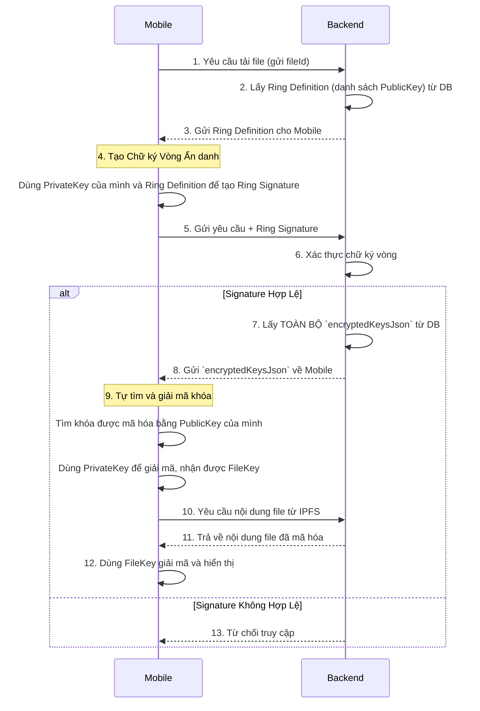
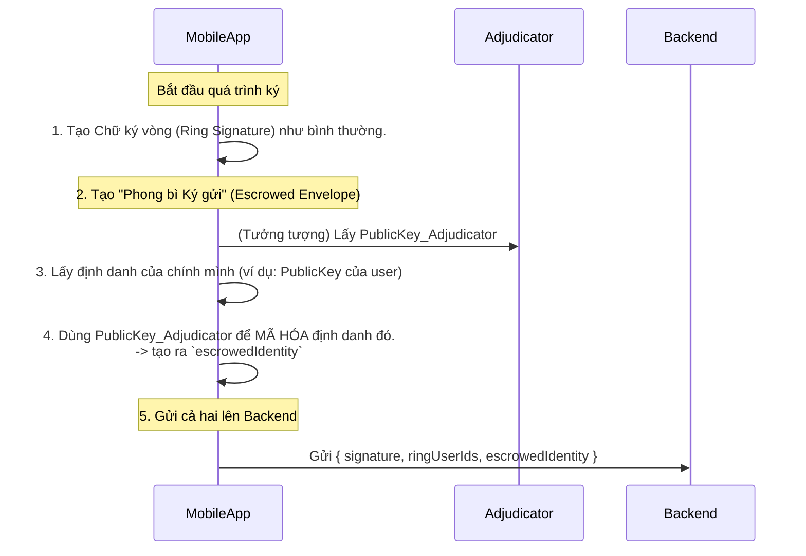

Chắc chắn rồi. Việc loại bỏ tính năng "mở ẩn danh" (opening anonymity) là một quyết định thiết kế hợp lý, giúp hệ thống trở nên đơn giản hơn và củng cố tính ẩn danh tuyệt đối. Chữ ký giờ đây sẽ không thể bị truy vết, ngay cả khi người ký muốn tự tiết lộ.

Hãy cùng phân tích lại toàn bộ kỹ thuật đã được tinh chỉnh này một cách kỹ lưỡng.

-----

### \#\# 1. Từ Cơ Bản: Các Nguyên Tắc Nền Tảng (Đã Tinh Chỉnh)

Mô hình của chúng ta vẫn dựa trên 4 trụ cột chính, nhưng với sự nhấn mạnh khác đi ở phần chữ ký vòng.

#### **A. Mã Hóa Dựa Trên Định Danh (Identity-Based Cryptography)** 🆔

* **Khái niệm:** Khóa công khai của người dùng được suy ra trực tiếp từ định danh của họ (ví dụ: email). [cite\_start]Backend sẽ đóng vai trò là "Master Entity" để tạo và cấp phát khóa bí mật tương ứng cho người dùng. [cite: 1, 16, 24]
* **Vai trò:** Giúp đơn giản hóa việc quản lý định danh và khóa trong hệ thống của bạn.

#### **B. Chữ Ký Vòng (Ring Signature) với Ẩn Danh Tuyệt Đối** ⭕

* [cite\_start]**Khái niệm:** Một thành viên trong nhóm ("ring") có thể ký một thông điệp thay mặt cho cả nhóm. [cite: 78, 79]
* **Sự thay đổi quan trọng:** Trong mô hình đã tinh chỉnh này, chữ ký vòng cung cấp tính **ẩn danh không thể đảo ngược**. [cite\_start]Một khi chữ ký được tạo ra, không có bất kỳ cách nào để xác định ai là người ký thật sự, kể cả khi người đó muốn tự nguyện chứng minh. [cite: 30, 96]
* **Vai trò:** Người dùng tạo chữ ký vòng để gửi yêu cầu đến Backend, nhằm chứng minh một cách ẩn danh rằng: *"Tôi là thành viên hợp lệ của nhóm được phép truy cập file này, hãy cho tôi quyền tải nó về."*

#### **C. Vấn Đề của Mã Hóa Đơn Thuần** 🔒

Mã hóa file là bắt buộc, nhưng chỉ mã hóa và gửi khóa cho mọi người thì không thể thu hồi quyền truy cập. Nếu bạn muốn chặn User C, họ vẫn giữ khóa cũ và có thể đọc file.

#### **D. Bài Toán Cốt Lõi: Thu Hồi Quyền (Revocation)** 🚫

Đây vẫn là thách thức trung tâm. Làm thế nào để vô hiệu hóa quyền truy cập của một người dùng đã từng được cấp phép? Giải pháp của chúng ta vẫn là **làm cho chiếc khóa cũ của họ trở nên vô dụng** thay vì cố gắng lấy lại nó.

-----

### \#\# 2. Nâng Cao: Cơ Chế Hoạt Động và Logic Triển Khai

Cơ chế hoạt động vẫn xoay quanh việc quản lý khóa và các "Kỷ nguyên" (Epoch), nhưng giờ đây không còn liên quan đến việc mở ẩn danh.

#### **A. Cập Nhật Mô Hình Dữ Liệu**

Chúng ta sẽ đơn giản hóa model `Signature` trong Prisma schema.

```prisma
// schema.prisma

model File {
  id           String   @id @default(cuid())
  filename     String
  ipfsHash     String   // Hash của file trong kỷ nguyên hiện tại
  epoch        Int      @default(1) // Số hiệu kỷ nguyên
  encryptedKeysJson String   // JSON chứa các khóa file đã mã hóa cho ring hiện tại
  uploaderId   String
  uploader     User     @relation("uploads", fields: [uploaderId], references: [id])
  signatures   Signature[]
  // ... timestamps
}

model Signature {
  id           String    @id @default(cuid())
  fileId       String
  file         File      @relation(fields: [fileId], references: [id])
  ringUserIds  String    // Danh sách PublicKey của các user trong ring
  signature    String    // Dữ liệu chữ ký vòng
  // Không còn các trường isOpened, openingProof, signerId
  // ... timestamps
}
```

Việc loại bỏ các trường này giúp schema gọn gàng hơn và củng cố cam kết về tính ẩn danh tuyệt đối.

#### **B. Logic "Epoch Rotation" - Trái Tim Của Việc Thu Hồi Quyền**

Logic này **không thay đổi** và vẫn là giải pháp cốt lõi cho việc thu hồi quyền. Nó hoạt động độc lập với việc có mở được ẩn danh hay không.

**Tóm tắt lại quy trình khi thu hồi quyền của User C:**

1.  **Kích hoạt:** Chủ sở hữu file gửi yêu cầu thu hồi quyền của User C.
2.  **Chuẩn bị:** Backend lấy thông tin của file ở kỷ nguyên hiện tại (`Epoch N`), bao gồm `CID_N` và `FileKey_N`.
3.  **Mã Hóa Lại:**
    * Tải nội dung đã mã hóa từ IPFS qua `CID_N`.
    * Giải mã nội dung bằng `FileKey_N`.
    * Tạo một `FileKey_N+1` hoàn toàn mới.
    * Mã hóa lại nội dung bằng `FileKey_N+1`.
4.  **Tạo Phiên Bản Mới:**
    * Tải nội dung vừa mã hóa lại lên IPFS, nhận về một `CID_N+1` mới.
5.  **Cập Nhật Quyền:**
    * Tạo một `Ring_N+1` (danh sách các PublicKey) không chứa `PublicKey` của User C.
    * Mã hóa `FileKey_N+1` bằng `PublicKey` của từng thành viên trong `Ring_N+1`.
6.  **Lưu Trạng Thái Mới:** Cập nhật bản ghi của file trong Database:
    * `epoch` = `N+1`
    * `ipfsHash` = `CID_N+1`
    * `encryptedKeysJson` = JSON chứa các khóa mới đã mã hóa.

Kết quả là `FileKey_N` và `CID_N` mà User C đang giữ trở nên lỗi thời và vô dụng. Họ không thể tham gia `Ring_N+1` để xin `FileKey_N+1` và do đó không thể truy cập file nữa.

#### **C. Luồng Yêu Cầu Truy Cập (Đã Tinh Chỉnh)**

Luồng này trở nên đơn giản và an toàn hơn.



**Tại sao lại gửi về toàn bộ `encryptedKeysJson`?**
Bởi vì Backend sau khi xác thực chữ ký vòng, nó chỉ biết yêu cầu đến từ "một người hợp lệ" chứ không biết chính xác là ai. Việc gửi về toàn bộ danh sách các khóa đã mã hóa giúp duy trì tính ẩn danh end-to-end. Client sẽ tự chịu trách nhiệm tìm và giải mã phần của mình.

### **3. Ưu và Nhược Điểm của Việc Loại Bỏ "Mở Ẩn Danh"**

* ✅ **Ưu điểm:**

    * **Ẩn danh mạnh hơn:** Không có backdoor hay "cửa hậu" nào để truy vết người ký. Một khi đã ký là hoàn toàn ẩn danh.
    * **Hệ thống đơn giản hơn:** Loại bỏ được logic và các trường dữ liệu phức tạp liên quan đến việc xác minh bằng chứng mở ẩn danh.
    * **Tăng sự tin tưởng:** Người dùng có thể tin tưởng rằng hành động của họ sẽ không bao giờ bị tiết lộ, khuyến khích các hoạt động cần sự bảo vệ cao (như tố giác).

* ❌ **Nhược điểm:**

    * **Mất khả năng giải trình:** Trong một số kịch bản, có thể cần đến việc người ký phải chịu trách nhiệm cho chữ ký của mình. [cite\_start]Ví dụ, sau khi một thông tin được đón nhận tích cực, người ký không thể出 đầu lộ diện để nhận công. [cite: 39]
    * [cite\_start]**Không thể chối cãi giả mạo:** Nếu một nhóm người muốn đổ tội cho một người trung thực, việc có cơ chế mở ẩn danh sẽ giúp người trung thực đó chứng minh mình không phải tác giả. [cite: 272] [cite\_start]Tuy nhiên, trong mô hình của chúng ta, việc giả mạo chữ ký là không thể nếu không có khóa bí mật. [cite: 97]

**Kết luận:** Việc loại bỏ tính năng mở ẩn danh là một sự đánh đổi giữa **ẩn danh tuyệt đối** và **khả năng giải trình**. Đối với một đề tài khoa học hoặc một hệ thống ưu tiên quyền riêng tư lên hàng đầu, lựa chọn của bạn là hoàn toàn đúng đắn và giúp mô hình trở nên mạnh mẽ, nhất quán hơn.

Được, chúng ta hoàn toàn có thể thiết kế một cơ chế cho phép một bên thứ ba tin cậy (thay vì người ký) có khả năng truy vết ngược lại danh tính. Mô hình này được gọi là **"Ẩn danh có Giám sát" (Escrowed Anonymity)**.

Đây là một giải pháp cân bằng giữa nhu cầu ẩn danh của người dùng và yêu cầu về trách nhiệm giải trình khi cần thiết (ví dụ: theo lệnh của tòa án hoặc quản trị viên hệ thống).

-----

### \#\# 1. Tổng quan về Mô hình "Ẩn danh có Giám sát"

Ý tưởng cốt lõi là trong khi tạo chữ ký vòng ẩn danh, người ký sẽ tạo thêm một "phong bì" được niêm phong. Bên trong phong bì này chứa danh tính của họ. Chỉ có một **Bên Giám sát (Adjudicator/Tracer)** được chỉ định trước mới có chìa khóa để mở phong bì này. Đối với những người khác, bao gồm cả Backend, phong bì này chỉ là một chuỗi dữ liệu vô nghĩa.

**Các thành phần tham gia:**

* **Người dùng (Mobile App):** Như cũ, có cặp khóa Công khai/Bí mật.
* **Backend Gateway:** Như cũ, xác thực chữ ký vòng.
* **Bên Giám sát (Adjudicator):** Một thực thể mới, có thể là một máy chủ riêng biệt hoặc một vai trò quản trị viên cấp cao. Thực thể này sở hữu một cặp khóa đặc biệt:
    * `PublicKey_Adjudicator`: Được công khai cho toàn hệ thống.
    * `PrivateKey_Adjudicator`: Được giữ bí mật tuyệt đối, có thể được lưu trữ offline để tăng cường bảo mật.

-----

### \#\# 2. Cơ chế Hoạt động Chi tiết

#### **A. Cập nhật Mô hình Dữ liệu**

Chúng ta sẽ điều chỉnh lại model `Signature` một lần nữa để thêm vào "phong bì ký gửi".

```prisma
// schema.prisma

model Signature {
  id              String   @id @default(cuid())
  fileId          String
  file            File     @relation(fields: [fileId], references: [id])
  ringUserIds     String   // Danh sách PublicKey của các user trong ring
  signature       String   // Dữ liệu chữ ký vòng
  
  // Phong bì ký gửi chứa danh tính đã được mã hóa
  escrowedIdentity  String   

  // ... timestamps
}
```

#### **B. Luồng Tạo Chữ ký Vòng có Giám sát (Phía Mobile App)**

Đây là bước được thay đổi nhiều nhất.



**Giải thích chi tiết:**

1.  Người dùng vẫn tạo chữ ký vòng như cũ để đảm bảo tính ẩn danh đối với Backend và những người dùng khác.
2.  **Bước quan trọng:** Trước khi gửi chữ ký đi, ứng dụng trên điện thoại sẽ lấy `PublicKey` của chính người dùng, sau đó dùng `PublicKey_Adjudicator` (đã được cấu hình sẵn trong app) để mã hóa nó.
3.  Kết quả của bước mã hóa này là một chuỗi dữ liệu `escrowedIdentity`. Chuỗi này được gửi kèm với chữ ký vòng lên Backend. Backend sẽ lưu cả hai vào database mà không thể đọc được nội dung của `escrowedIdentity`.

#### **C. Luồng Truy vết (Thực hiện bởi Bên Giám sát)**

Quá trình này chỉ xảy ra khi có yêu cầu hợp lệ.

1.  **Thu thập bằng chứng:** Quản trị viên hệ thống truy vấn vào database và lấy ra bản ghi `Signature` cần truy vết, bao gồm cả chuỗi `escrowedIdentity`.
2.  **Chuyển giao:** Bản ghi này được chuyển đến cho Bên Giám sát một cách an toàn.
3.  **Giải mã:**
    * Bên Giám sát sử dụng **`PrivateKey_Adjudicator`** của mình để giải mã chuỗi `escrowedIdentity`.
    * Kết quả giải mã sẽ là `PublicKey` của người đã thực sự tạo ra chữ ký đó.
4.  **Kết luận:** Danh tính của người ký đã được xác định.

-----

### \#\# 3. So sánh và Đánh giá

Mô hình này tạo ra một sự cân bằng tinh tế.

| Tiêu chí | Mở ẩn danh (Người ký) | Ẩn danh Tuyệt đối | **Ẩn danh có Giám sát (Bên thứ 3)** |
| :--- | :--- | :--- | :--- |
| **Ai có thể truy vết?** | Chỉ người ký | Không một ai | Chỉ Bên Giám sát |
| **Mức độ ẩn danh** | Có điều kiện (do người ký quyết định) | Tuyệt đối, không thể đảo ngược | Cao, nhưng có thể bị truy vết trong trường hợp đặc biệt |
| **Khả năng giải trình** | Có, nếu người ký muốn | Không có | Có, nhưng bị kiểm soát chặt chẽ |
| **Độ phức tạp** | Trung bình (thêm logic mở) | Thấp nhất | Trung bình (thêm logic ký gửi và vai trò mới) |
| **Trường hợp sử dụng** | Cần sự linh hoạt, người ký có thể muốn nhận trách nhiệm/công lao. | Ưu tiên quyền riêng tư tuyệt đối, bảo vệ người tố giác. | Môi trường doanh nghiệp, tổ chức cần cân bằng giữa riêng tư và tuân thủ pháp luật. |

**Kết luận:** Mô hình **Ẩn danh có Giám sát** là một lựa chọn rất mạnh mẽ và thực tế cho các hệ thống yêu cầu trách nhiệm. Nó giữ được tính ẩn danh trong các hoạt động hàng ngày, đồng thời cung cấp một "công tắc an toàn" cho phép truy vết khi có lý do chính đáng, đáp ứng chính xác yêu cầu của bạn về việc truy vết bởi một bên thứ ba.