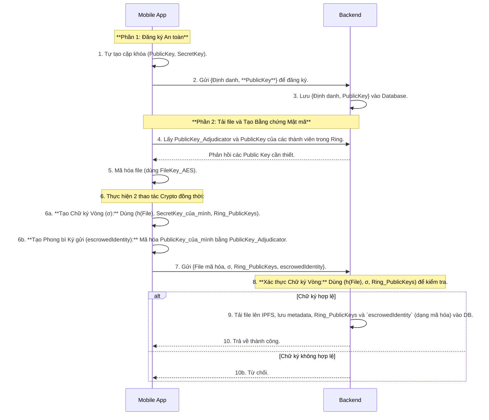
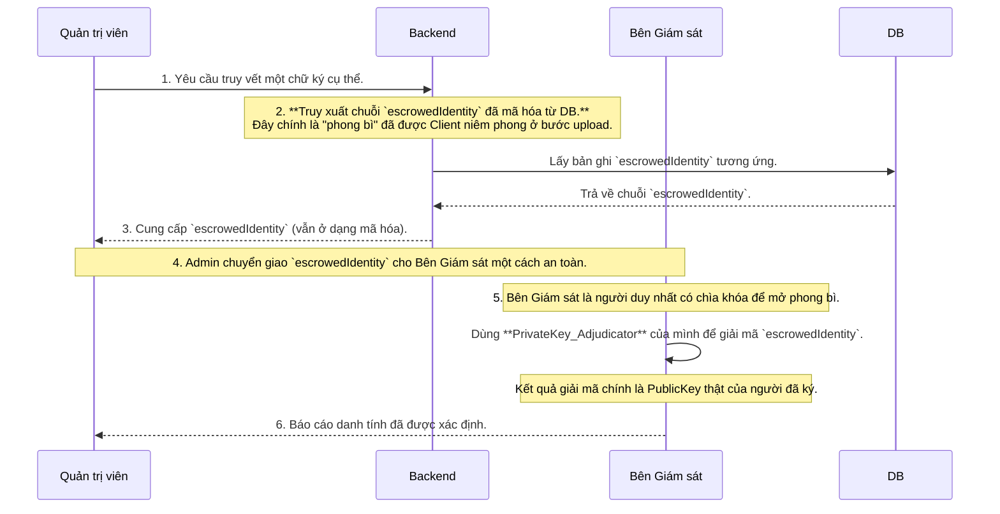
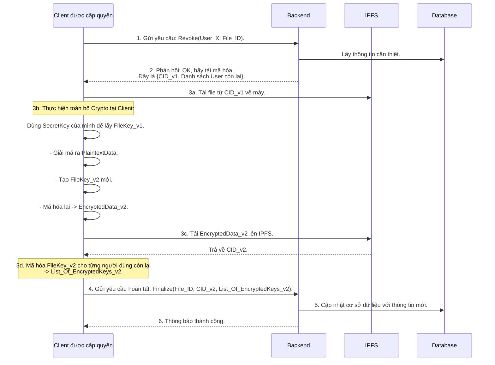

Chắc chắn rồi. Đây là những câu hỏi rất xác đáng và quan trọng, cho thấy bạn đang tư duy sâu về chi tiết của luồng mật mã. Việc làm rõ những điểm này là cực kỳ cần thiết để đảm bảo kiến trúc của bạn không có lỗ hổng logic.

Hãy cùng cập nhật lại bài viết hoàn chỉnh, trong đó tôi sẽ giải thích cặn kẽ những khái niệm này ngay trong luồng kiến trúc.

-----

## **Kiến trúc Hệ thống Toàn diện: Giải pháp Lưu trữ Phi tập trung (Phiên bản đã làm rõ)**

[cite\_start]Bài viết này trình bày kiến trúc hệ thống cuối cùng cho đề tài **"Giải pháp lưu trữ và chia sẻ dữ liệu phi tập trung đảm bảo tính riêng tư"**[cite: 5]. Kiến trúc này tích hợp các cơ chế mật mã nâng cao để đạt được sự cân bằng giữa ẩn danh, bảo mật và trách nhiệm giải trình.

-----

### **1. Các Khái niệm Mật mã Nền tảng**

Trước khi đi vào các luồng chi tiết, chúng ta cần làm rõ 2 cơ chế mật mã cốt lõi sẽ được sử dụng.

#### **A. Chữ ký Vòng (Ring Signature)**

[cite\_start]Chữ ký vòng là một loại chữ ký điện tử cho phép một thành viên trong một nhóm người ký một thông điệp thay mặt cho cả nhóm, nhưng không ai có thể biết chính xác thành viên nào đã thực hiện việc ký đó[cite: 25, 26].

* **Tạo Chữ ký Vòng như thế nào?**
    * **Đầu vào:**
        1.  **Thông điệp cần ký:** Thường là hash của file (`h(M)`).
        2.  **Khóa bí mật của người ký (`SecretKey_User`):** Đây là khóa bí mật mà người dùng đã tự tạo và lưu trên thiết bị của mình.
        3.  **Tập hợp khóa công khai của nhóm (`Ring`):** Đây là một danh sách các `PublicKey` của tất cả thành viên trong nhóm ký (bao gồm cả `PublicKey` của chính người ký). Danh sách này được lấy từ Backend.
    * **Quá trình:** Người dùng (trên ứng dụng di động) sử dụng thuật toán mật mã, kết hợp `SecretKey` của mình với danh sách `PublicKey` của cả nhóm để tạo ra một chuỗi dữ liệu duy nhất, đó chính là Chữ ký Vòng (`σ`).
* **Xác thực Chữ ký Vòng như thế nào?**
    * **Đầu vào:**
        1.  Thông điệp gốc (hoặc `h(M)`).
        2.  Chữ ký Vòng (`σ`).
        3.  Danh sách `PublicKey` của nhóm (`Ring`) đã được dùng để tạo chữ ký.
    * **Quá trình:** Bên xác thực (ở đây là **Backend Gateway**) chạy một thuật toán kiểm tra. Thuật toán này không cần bất kỳ `SecretKey` nào. Nó sẽ trả về `True` nếu chữ ký hợp lệ và được tạo bởi một thành viên trong nhóm, ngược lại trả về `False`.

#### **B. Phong bì Ký gửi (Escrowed Identity) và Bên Giám sát (Adjudicator)**

* **Tại sao lại xuất hiện `escrowedIdentity`?**
    * Chữ ký vòng mang lại tính ẩn danh tuyệt đối. [cite\_start]Tuy nhiên, mục tiêu của đề tài là **"ẩn danh có giám sát"**, nghĩa là cần một cơ chế để truy vết danh tính trong trường hợp đặc biệt (ví dụ: vi phạm quy định)[cite: 5, 29]. `escrowedIdentity` chính là cơ chế đó.
* **Nó là gì?**
    * `escrowedIdentity` là một "phong bì niêm phong kỹ thuật số". Bên trong phong bì chứa **danh tính thật của người ký** (ví dụ: `PublicKey` của họ).
    * Phong bì này được "niêm phong" (mã hóa) bằng một chiếc khóa đặc biệt mà chỉ có **Bên Giám sát (Adjudicator)** mới có thể mở.
* **`PublicKey_Adjudicator` ở đâu ra?**
    * Bên Giám sát là một thực thể tin cậy của hệ thống. Họ sẽ tạo ra một cặp khóa `Public/Private` cho riêng mình. `PublicKey_Adjudicator` của họ sẽ được **công bố công khai**, thường do Backend Gateway cung cấp cho các client khi cần. Client sẽ lấy khóa này để "niêm phong" phong bì.

-----

### **2. Luồng Hoạt động Chi tiết (Đã cập nhật và làm rõ)**

#### **A. Đăng ký và Tải file có Giám sát**

#### **B. Truy vết Danh tính**

-----

### **3. Luồng Rút quyền Truy cập (Client-Side Re-encryption)**

Luồng này không thay đổi về mặt logic, nhưng giờ đây chúng ta đã hiểu rõ hơn về các thành phần mật mã được sử dụng bên trong.

-----

### **4. Kết luận**

Bằng việc làm rõ các khái niệm mật mã nền tảng, kiến trúc hệ thống giờ đây đã trở nên hoàn chỉnh và chặt chẽ về mặt logic. Các luồng hoạt động không chỉ được mô tả về mặt kỹ thuật mà còn được giải thích rõ ràng về mặt "tại sao", giúp củng cố tính thuyết phục và giá trị học thuật cho luận văn của bạn.