# IPFS ID-RS System Architecture Documentation

## Overview

This document provides a comprehensive system architecture analysis of the IPFS Identity-based Ring Signatures (ID-RS) system, including detailed flow diagrams from mobile application to backend services to IPFS network operations.

## System Architecture Overview

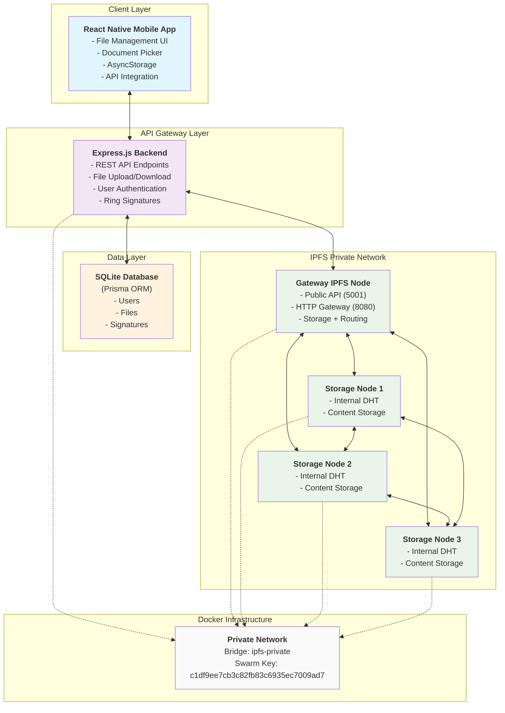

## Simplified Diagrams for Presentation

### 1. System Overview (Slide Version)

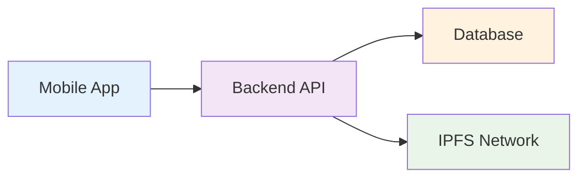

### 2. File Upload Flow (Slide Version)

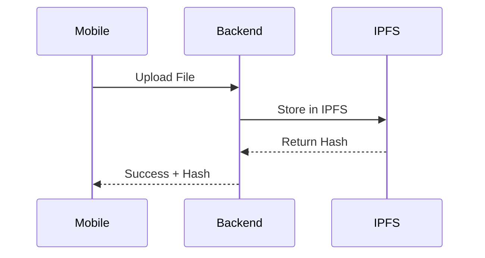

### 3. File Download Flow (Slide Version)

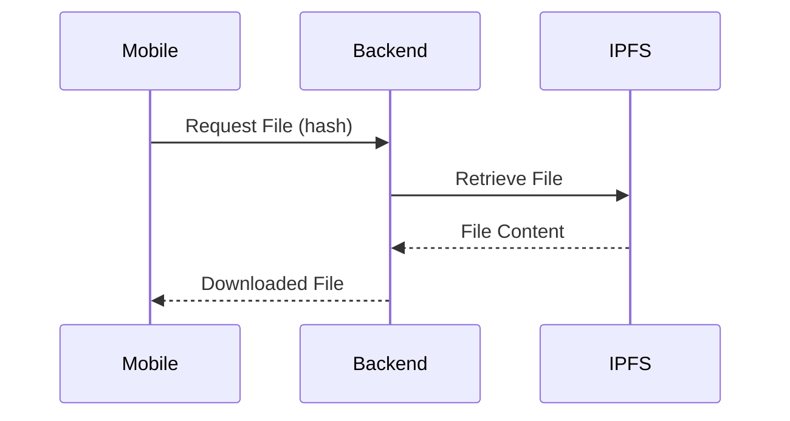

### 4. IPFS Network Structure (Slide Version)

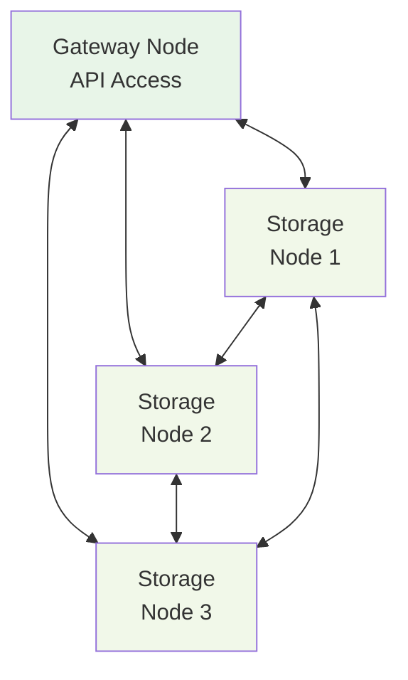

### 5. Mobile App Architecture (Slide Version)

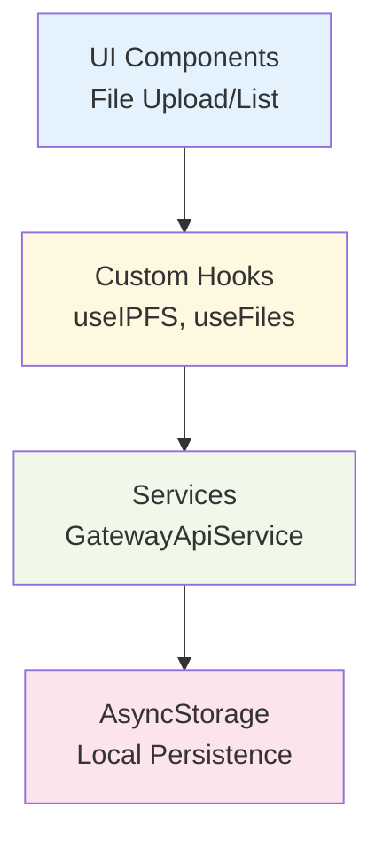

### 6. File Listing Flow (Slide Version)

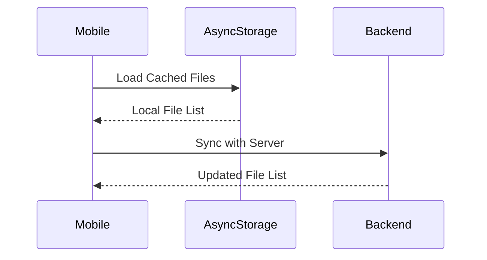

### 7. File Delete Flow (Slide Version)

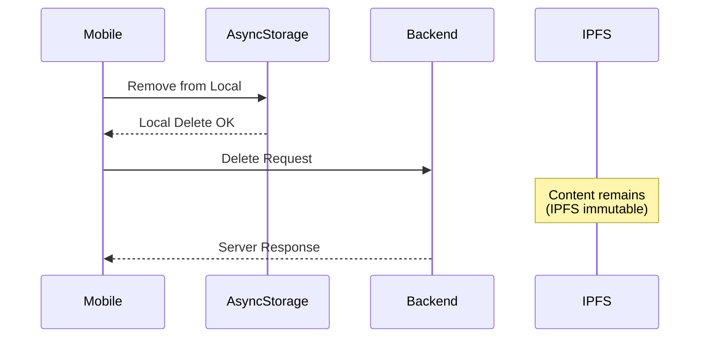

### 8. Security Architecture (Slide Version)

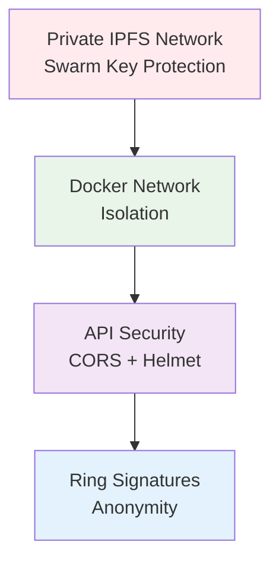

### 9. Data Flow Overview (Slide Version)

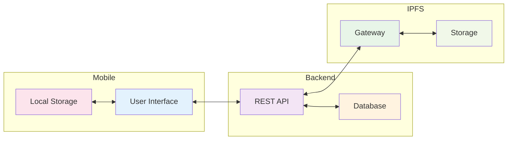

## Detailed Component Architecture

### Mobile Application Layer

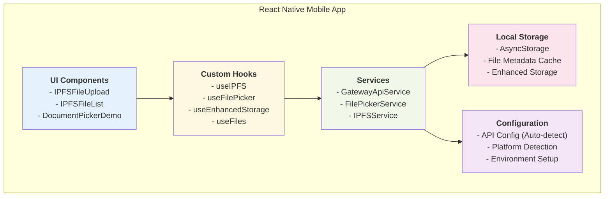

### Backend API Layer

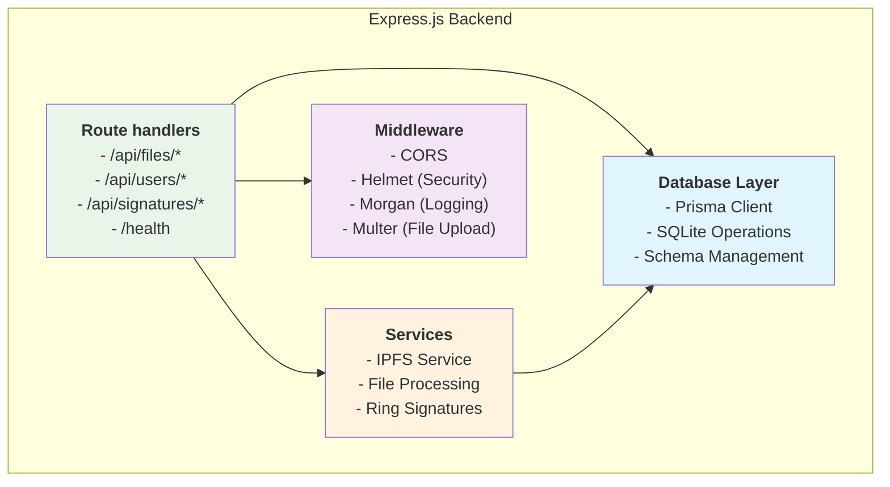

## CRUD Operations Flow

### File Upload Operation (CREATE)

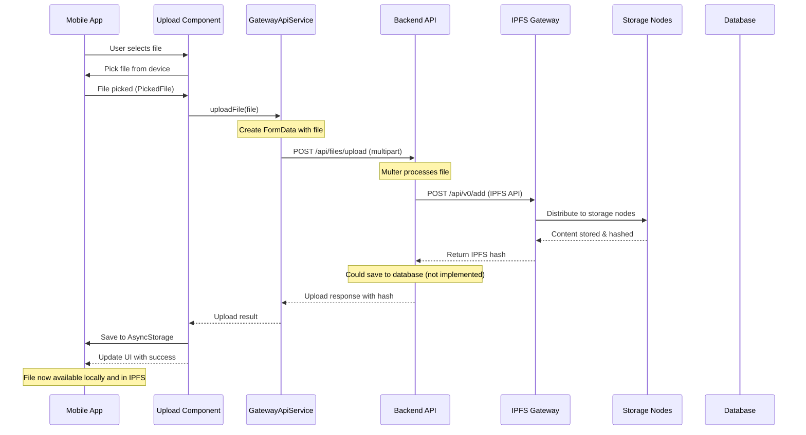

### File Retrieval Operation (READ)

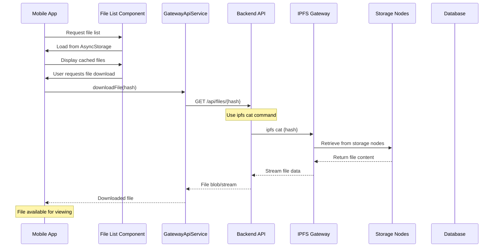

### File Listing Operation (READ)

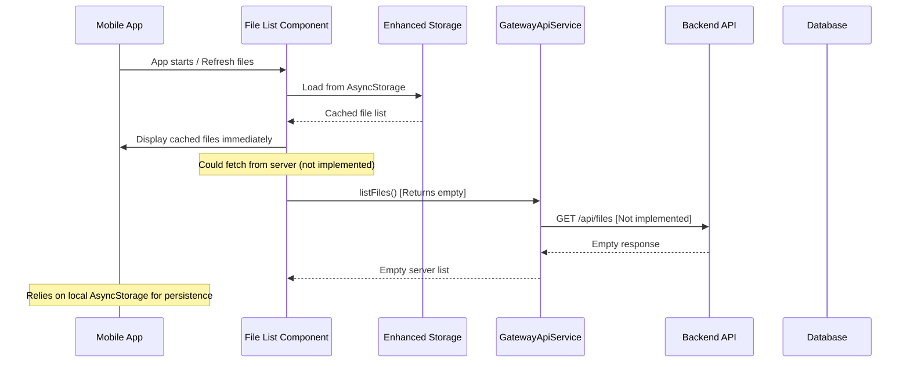

### File Delete Operation (DELETE)

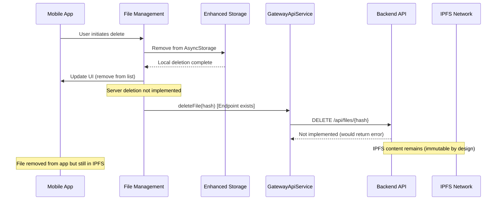

## Network Topology & Communication Patterns

### Docker Network Architecture

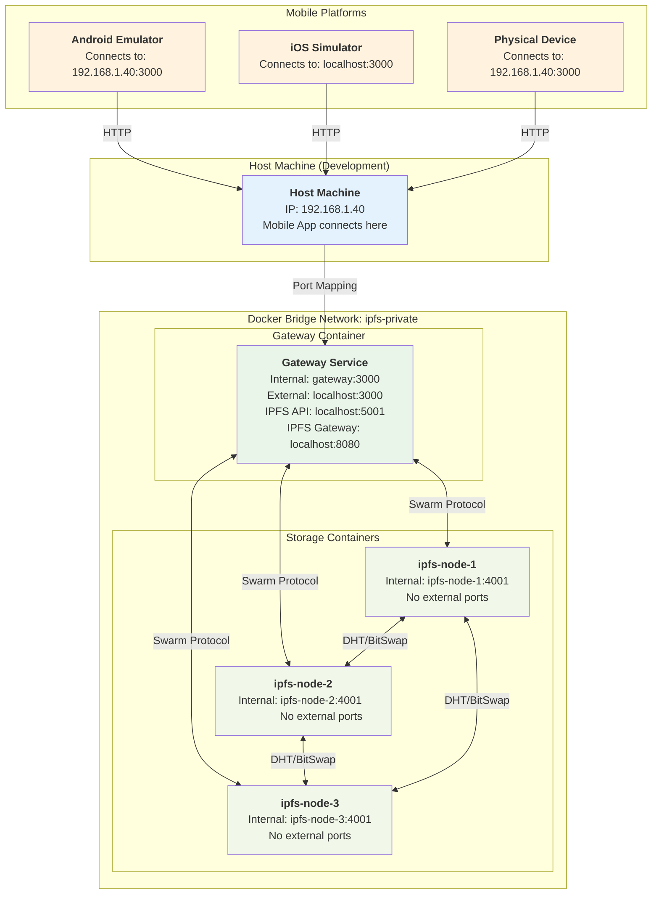

### API Communication Patterns

```mermaid
graph LR
    subgraph "Mobile App"
        Comp["`**Components**
        File Upload/List`"]
        Hook["`**Hooks**
        useIPFS`"]
        Svc["`**Service**
        GatewayApiService`"]
    end

    subgraph "Backend API"
        Route["`**Routes**
        /api/files/*`"]
        IPFS["`**IPFS Service**
        Direct commands`"]
    end

    subgraph "IPFS Network"
        Gateway["`**Gateway Node**
        API + Storage`"]
        Nodes["`**Storage Nodes**
        Content Distribution`"]
    end

    %% Request flow
    Comp -->|User Action| Hook
    Hook -->|API Call| Svc
    Svc -->|HTTP Request| Route
    Route -->|IPFS Command| IPFS
    IPFS -->|Local API| Gateway
    Gateway <-->|Swarm| Nodes

    %% Response flow  
    Nodes -->|Content| Gateway
    Gateway -->|Response| IPFS
    IPFS -->|JSON/Stream| Route
    Route -->|HTTP Response| Svc
    Svc -->|Result| Hook
    Hook -->|State Update| Comp

    style Comp fill:#e3f2fd
    style Hook fill:#fff8e1
    style Svc fill:#f1f8e9
    style Route fill:#e8f5e8
    style IPFS fill:#fff3e0
    style Gateway fill:#f3e5f5
    style Nodes fill:#fce4ec
```

## Data Models & Schema

### Database Schema Relationships

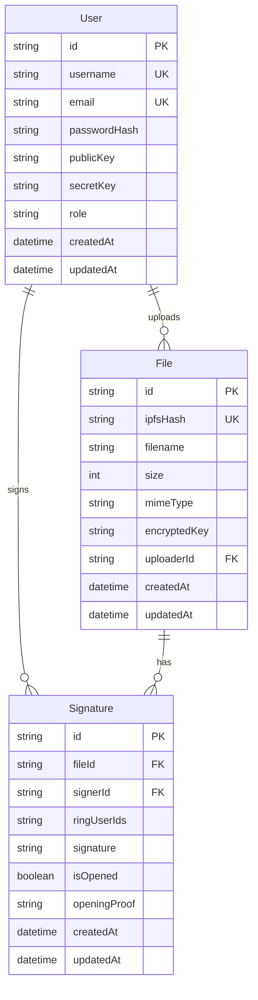

### Data Flow Patterns

```mermaid
graph TB
    subgraph "Mobile Storage"
        AS["`**AsyncStorage**
        - File metadata
        - Upload history
        - User preferences`"]
        
        Cache["`**Memory Cache**
        - Active file list
        - Component state`"]
    end

    subgraph "API Data Exchange"
        Upload["`**Upload Flow**
        Mobile → Backend → IPFS`"]
        
        Download["`**Download Flow**
        IPFS → Backend → Mobile`"]
        
        Metadata["`**Metadata Flow**
        Database ↔ Backend ↔ Mobile`"]
    end

    subgraph "IPFS Content Storage"
        Content["`**Content-Addressed Storage**
        - Immutable files
        - Distributed across nodes`"]
        
        DHT["`**Distributed Hash Table**
        - Content discovery
        - Peer routing`"]
    end

    subgraph "Database Persistence"
        UserData["`**User Management**
        - Authentication
        - Key management`"]
        
        FileDB["`**File Registry**
        - IPFS hash mapping
        - Metadata storage`"]
        
        SigDB["`**Signature Records**
        - Ring signatures
        - Verification proofs`"]
    end

    %% Data flow connections
    AS <--> Cache
    Cache <--> Upload
    Cache <--> Download
    Upload --> Content
    Download <-- Content
    Content <--> DHT
    
    Upload --> FileDB
    Download <-- FileDB
    Metadata <--> UserData
    Metadata <--> FileDB
    Metadata <--> SigDB

    style AS fill:#e3f2fd
    style Cache fill:#f1f8e9
    style Upload fill:#fff8e1
    style Download fill:#fff3e0
    style Metadata fill:#f3e5f5
    style Content fill:#e8f5e8
    style DHT fill:#fce4ec
    style UserData fill:#e1f5fe
    style FileDB fill:#fff3e0
    style SigDB fill:#f3e5f5
```

## Security Architecture

### Private IPFS Network Security

```mermaid
graph TB
    subgraph "Security Layers"
        subgraph "Network Isolation"
            SwarmKey["`**Swarm Key Protection**
            - Shared key: c1df9ee7cb3c...
            - LIBP2P_FORCE_PNET=1
            - Bootstrap removal`"]
            
            DockerNet["`**Docker Network Isolation**
            - Private bridge network
            - Internal-only storage nodes
            - Gateway as single entry point`"]
        end
        
        subgraph "API Security"
            CORS["`**CORS Configuration**
            - Origin restrictions
            - Method limitations`"]
            
            Helmet["`**Security Headers**
            - XSS protection
            - Content security policy`"]
            
            RateLimit["`**Potential Rate Limiting**
            - Upload size limits (50MB)
            - Request throttling`"]
        end
        
        subgraph "Cryptographic Security"  
            RingSig["`**Ring Signatures**
            - Anonymous signatures
            - Non-repudiation
            - Opening proofs`"]
            
            KeyMgmt["`**Key Management**
            - User public/private keys
            - File encryption keys`"]
        end
    end

    subgraph "Access Control"
        Gateway["`**Gateway Node**
        - Only public IPFS API access
        - File upload/download control`"]
        
        Storage["`**Storage Nodes**
        - No external access
        - Internal communication only`"]
    end

    SwarmKey --> DockerNet
    DockerNet --> Gateway
    Gateway --> Storage
    CORS --> Gateway
    Helmet --> Gateway
    RingSig --> KeyMgmt
    
    style SwarmKey fill:#ffebee
    style DockerNet fill:#e8f5e8
    style CORS fill:#fff3e0
    style Helmet fill:#f3e5f5
    style RateLimit fill:#e1f5fe
    style RingSig fill:#fce4ec
    style KeyMgmt fill:#f1f8e9
    style Gateway fill:#e3f2fd
    style Storage fill:#fff8e1
```

## Performance & Scalability Considerations

### Current System Limitations & Optimizations

```mermaid
graph TB
    subgraph "Current Performance Bottlenecks"
        SingleGW["`**Single Gateway Node**
        - All API traffic through one node
        - Potential bottleneck for uploads`"]
        
        SyncOps["`**Synchronous Operations**
        - File uploads block UI
        - No background processing`"]
        
        LocalStorage["`**AsyncStorage Limitations**
        - Large file lists may slow down
        - No pagination`"]
    end

    subgraph "Optimization Strategies"
        LoadBalance["`**Load Balancing**
        - Multiple gateway nodes
        - API request distribution`"]
        
        AsyncOps["`**Asynchronous Processing**
        - Background uploads
        - Progress tracking
        - Queue management`"]
        
        Caching["`**Enhanced Caching**
        - File metadata caching
        - Pagination implementation
        - Lazy loading`"]
    end

    subgraph "Scaling Options"
        MoreNodes["`**Additional IPFS Nodes**
        - Increase storage capacity
        - Better content distribution`"]
        
        DatabaseUpgrade["`**Database Scaling**
        - PostgreSQL migration
        - Connection pooling`"]
        
        CDN["`**Content Delivery**
        - IPFS public gateways
        - Geographic distribution`"]
    end

    SingleGW --> LoadBalance
    SyncOps --> AsyncOps
    LocalStorage --> Caching
    LoadBalance --> MoreNodes
    AsyncOps --> DatabaseUpgrade
    Caching --> CDN

    style SingleGW fill:#ffebee
    style SyncOps fill:#ffebee
    style LocalStorage fill:#ffebee
    style LoadBalance fill:#e8f5e8
    style AsyncOps fill:#e8f5e8
    style Caching fill:#e8f5e8
    style MoreNodes fill:#e3f2fd
    style DatabaseUpgrade fill:#e3f2fd
    style CDN fill:#e3f2fd
```

## System Health & Monitoring

### Health Check Architecture

```mermaid
graph TB
    subgraph "Health Monitoring"
        HealthAPI["`**Health Endpoint**
        GET /health
        - Service status
        - Timestamp
        - Basic connectivity`"]
        
        IPFSHealth["`**IPFS Connectivity**
        GET /api/files/test-ipfs
        - IPFS API version
        - Node connectivity`"]
        
        DockerHealth["`**Container Health**
        - Docker healthcheck
        - wget localhost:3000/health
        - 30s intervals`"]
    end

    subgraph "Monitoring Points"
        APIGateway["`**API Gateway**
        - Response times
        - Request success rate
        - Error logging`"]
        
        IPFSNodes["`**IPFS Nodes**
        - Peer connections
        - Content availability
        - Storage usage`"]
        
        Database["`**Database**
        - Connection status
        - Query performance
        - Storage size`"]
    end

    subgraph "Logging & Debugging"
        Morgan["`**HTTP Logging**
        - Request/response logs
        - Performance metrics`"]
        
        Console["`**Debug Output**
        - IPFS operations
        - Error details
        - Transaction logs`"]
    end

    HealthAPI --> APIGateway
    IPFSHealth --> IPFSNodes
    DockerHealth --> Database
    APIGateway --> Morgan
    IPFSNodes --> Console
    Database --> Console

    style HealthAPI fill:#e8f5e8
    style IPFSHealth fill:#f1f8e9
    style DockerHealth fill:#fff3e0
    style APIGateway fill:#e3f2fd
    style IPFSNodes fill:#f3e5f5
    style Database fill:#fce4ec
    style Morgan fill:#fff8e1
    style Console fill:#e1f5fe
```

## Deployment Architecture

### Development vs Production Deployment

```mermaid
graph TB
    subgraph "Development Environment"
        DevMobile["`**Mobile Development**
        - React Native Metro
        - Hot reload
        - Device/emulator testing`"]
        
        DevBackend["`**Backend Development**
        - nodemon auto-reload
        - SQLite local database
        - Docker Compose local`"]
        
        DevIPFS["`**IPFS Development**
        - Local private network
        - 4-node cluster
        - Shared swarm key`"]
    end

    subgraph "Production Considerations"
        ProdMobile["`**Mobile Production**
        - App store deployment
        - Production API endpoints
        - Certificate pinning`"]
        
        ProdBackend["`**Backend Production**
        - Load balancing
        - Database clustering
        - SSL/TLS termination`"]
        
        ProdIPFS["`**IPFS Production**
        - Multiple gateway nodes
        - Content replication
        - Backup strategies`"]
    end

    subgraph "Infrastructure Requirements"
        Containers["`**Container Orchestration**
        - Docker Swarm/Kubernetes
        - Service discovery
        - Health monitoring`"]
        
        Storage["`**Persistent Storage**
        - Volume management
        - Database backups
        - IPFS data persistence`"]
        
        Networking["`**Network Security**
        - VPN/Private networks
        - Firewall rules
        - Load balancers`"]
    end

    DevMobile --> ProdMobile
    DevBackend --> ProdBackend
    DevIPFS --> ProdIPFS
    ProdMobile --> Containers
    ProdBackend --> Storage
    ProdIPFS --> Networking

    style DevMobile fill:#e3f2fd
    style DevBackend fill:#f1f8e9
    style DevIPFS fill:#fff8e1
    style ProdMobile fill:#e8f5e8
    style ProdBackend fill:#fff3e0
    style ProdIPFS fill:#f3e5f5
    style Containers fill:#fce4ec
    style Storage fill:#e1f5fe
    style Networking fill:#ffebee
```

## Summary

This IPFS ID-RS system provides a comprehensive solution for decentralized file storage with privacy-preserving ring signatures. The architecture demonstrates:

1. **Layered Architecture**: Clear separation between mobile client, API gateway, and IPFS storage
2. **Security Focus**: Private IPFS network with cryptographic signatures
3. **Development Ready**: Dockerized environment with auto-configuration
4. **Scalability Considerations**: Identified bottlenecks and optimization paths
5. **Production Readiness**: Health monitoring and deployment considerations

### Key Technical Achievements

- ✅ **Functional IPFS Private Network**: 4-node cluster with shared swarm key
- ✅ **Cross-Platform Mobile App**: React Native with TypeScript
- ✅ **RESTful API Gateway**: Express.js with comprehensive file operations
- ✅ **Database Integration**: Prisma ORM with relational schema
- ✅ **Containerized Deployment**: Docker Compose with health checks
- ✅ **Enhanced Storage**: Local persistence with cloud synchronization

### Current Implementation Status

- **File Upload/Download**: ✅ Fully functional
- **IPFS Network**: ✅ Operational with 4 nodes
- **Database Schema**: ✅ Defined and ready
- **Mobile UI**: ✅ Complete file management interface
- **Security**: ✅ Private network with access controls
- **Ring Signatures**: 🔄 Schema ready, implementation pending
- **User Authentication**: 🔄 Routes defined, implementation pending
- **Database Integration**: 🔄 File metadata storage pending

This architecture provides a solid foundation for a production-ready decentralized file storage system with advanced cryptographic capabilities.