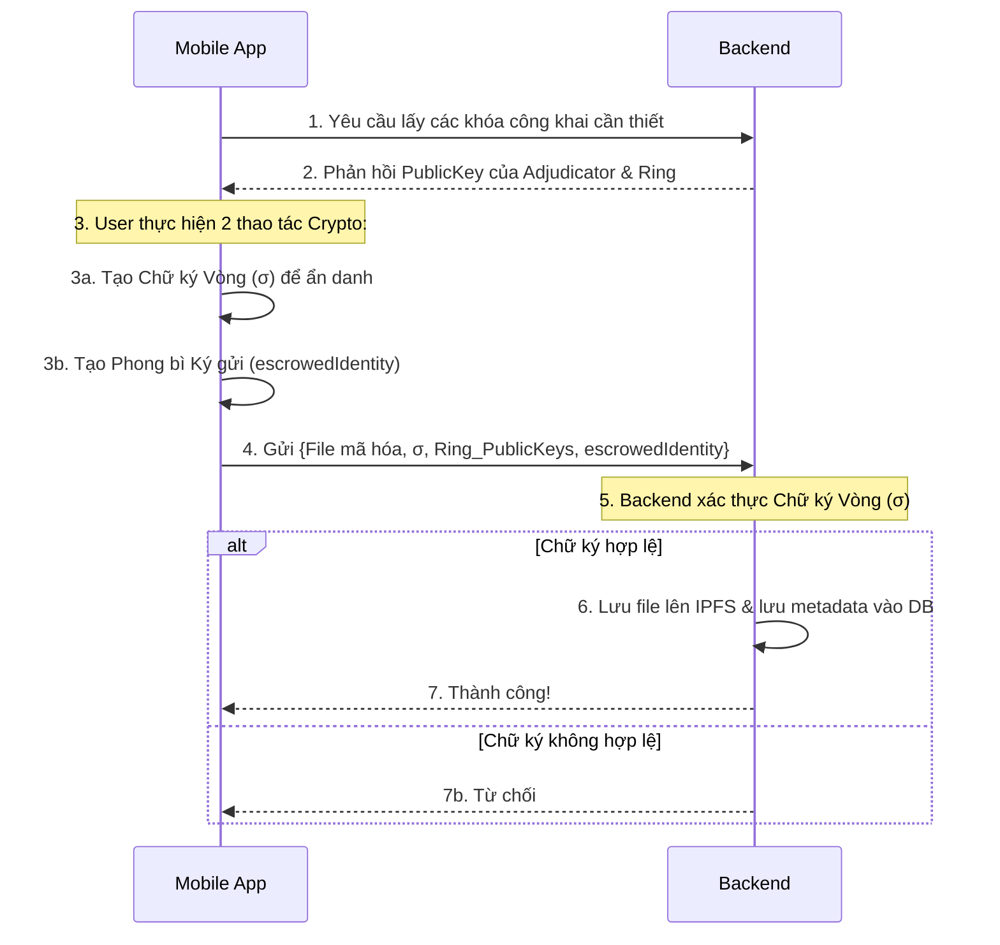
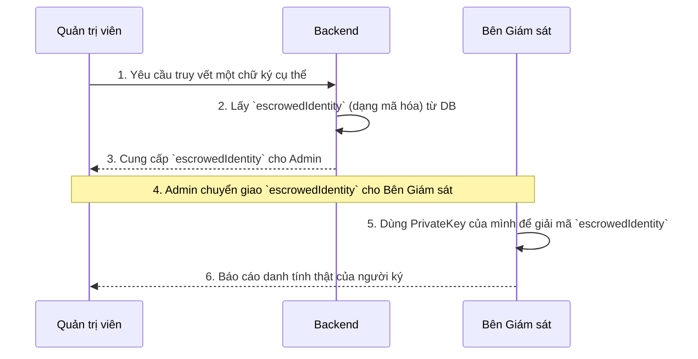
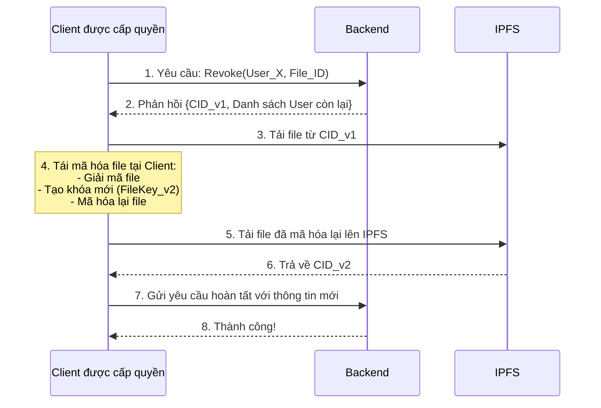

Nội dung Slide Thuyết trình: Kiến trúc Hệ thống

Slide 1: Đặt vấn đề & Mục tiêu

Bài toán: Làm thế nào để người dùng có thể chia sẻ dữ liệu một cách ẩn danh, nhưng hệ thống vẫn có thể xác định danh tính trong trường hợp người dùng đăng tải nội dung xấu hoặc vi phạm?

Mục tiêu chính: Xây dựng một hệ thống cân bằng được 3 yếu tố:

- Ẩn danh (Anonymity): Che giấu danh tính người tải file.
- Bảo mật (Security): Đảm bảo an toàn và toàn vẹn dữ liệu.
- Trách nhiệm (Accountability): Có cơ chế truy vết khi cần thiết.

Slide 2: Các "Viên gạch" Mật mã Cốt lõi

Để giải quyết bài toán trên, chúng ta sử dụng 2 kỹ thuật mật mã chính:
1. Chữ ký Vòng (Ring Signature)
   - Ý tưởng: Một thành viên ký thay mặt cho cả nhóm.
   - Kết quả: Mọi người đều biết chữ ký đến từ một người trong nhóm, nhưng không biết chính xác là ai.
   - Vai trò: Cung cấp tính ẩn danh cho người dùng.

2. Phong bì Ký gửi (Escrowed Identity)
   - Ý tưởng: Một "phong bì" kỹ thuật số được niêm phong, bên trong chứa danh tính thật của người ký.
   - Cơ chế: Phong bì này chỉ có thể được mở bởi một bên thứ ba được tin tưởng là Bên Giám sát (Adjudicator).
   - Vai trò: Cung cấp khả năng truy vết (trách nhiệm).

Slide 3: Luồng 1 - Tải File Lên (Ẩn danh có Giám sát)

Slide 4: Luồng 2 - Truy vết Danh tính

Slide 5: Luồng 3 - Thu hồi Quyền Truy cập
- Kỹ thuật: Tái mã hóa phía Client (Client-Side Re-encryption).
- Mục đích: Khi một người dùng bị thu hồi quyền, file sẽ được mã hóa lại với một khóa mới, và khóa mới này chỉ được chia sẻ cho những người còn lại.sequenceDiagram

Slide 6: Kết luận
- Kiến trúc đã kết hợp thành công Chữ ký Vòng (ẩn danh) và Phong bì Ký gửi (truy vết).
- Hệ thống đạt được sự cân bằng giữa tính riêng tư cho người dùng và khả năng quản lý của hệ thống.
- Giải quyết được bài toán "ẩn danh có giám sát" một cách hiệu quả và logic.